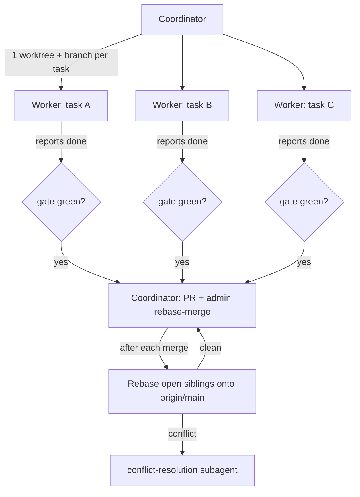

<!-- file: docs/agent-tasks/ORCHESTRATION.md -->
<!-- version: 1.0.0 -->
<!-- guid: df5d27e7-bb08-4d9d-adf7-0dc17da6c779 -->
<!-- last-edited: 2026-07-09 -->

# Orchestration — running many task-agents in parallel

The coordinator + worker protocol for executing the `TASK-*.md` briefs in this tree.
Adapted from the proven audiobook-organizer pattern. It lets several task agents run
at once without stepping on each other, then merges them one at a time with automatic
sibling rebasing.

The model is **coordinator + workers**:

- **Workers** are AI agents, one per task, each confined to its own git worktree
  (`$REPO/.worktrees/<ws>-<slug>`, branch `agent/<ws>-<slug>` off `origin/main`).
  Workers only read/write code and run tests. **Workers never run `git push`,
  `gh pr ...`, or merge** — they report "done" with exact counts and hand back.
- **The coordinator** (you, or a stronger agent) owns all git/gh: it creates the
  worktrees, gates each finished worker on the local test gate, opens + merges the
  PR (`gh pr merge --admin --rebase`), and rebases the still-open siblings after
  each merge.



## Why this shape

| Risk | Mitigation |
|------|------------|
| Two agents edit the same file → corrupt merges | One worktree per task; same-file tasks serialized into waves (see the collision matrix in [README.md](README.md)). |
| Agent pushes/merges half-done work | Only the coordinator touches git/gh. Workers are report-only. |
| Sibling branches drift from main and rot | After every merge, rebase all open siblings onto `origin/main`. |
| A weak worker model wanders | Each brief is fully self-contained with grep-verified anchors and independently checkable acceptance criteria; the coordinator rejects a "done" that fails the gate. |
| Tasks have dependencies | Waves. A task whose `Depends on:` isn't merged yet does not start. |
| A worker touches prod infrastructure | HARD RULE: tasks are code/docs only, validated in VM/QEMU. Nothing installs to, wipes, or writes on 172.16.2.30, len-serv-003, or any live host. |

## The gate

Every task in this tree gates on:

```bash
cargo test --lib --offline        # Expected: >=237 passed; 0 failed
cargo build --offline             # Expected: exit 0
```

plus any brief-specific checks (`cargo clippy --offline`, `bash -n <script>`,
`python3 -m py_compile scripts/autoinstall-agent.py`).

## Coordinator protocol (verbatim — embed in dispatch prompts)

> **Coordinator owns git. Workers never push.** Each worker operates only inside its
> assigned worktree: edit, test, commit — then stop. Workers never run `git push`,
> `gh pr`, or any merge command. The coordinator runs the gate
> (`cargo test --lib --offline && cargo build --offline`) in each finished worktree,
> opens the PR, merges (rebase/FF), and then **rebases every open sibling worktree**
> before dispatching anything else.
>
> **Per-merge sibling-rebase loop:** after EVERY merge to `origin/main`: for each open
> sibling worktree, `git fetch origin && git rebase origin/main`. A sibling that skips
> a rebase is a future conflict.
>
> **Conflict escalation ladder** (in order, never skip a rung): 1) clean rebase;
> 2) conflict-resolver subagent (Sonnet-class, only when the conflict spans 1–3 small
> files); 3) file-copy cherry-pick fallback — re-apply the task's file states onto a
> fresh branch from HEAD; 4) mark `rebase_blocked`, stop the lane, escalate to a human.
>
> **A wave MUST NOT start** while any of: the previous wave has an unmerged PR; any
> sibling worktree is un-rebased; the gate is red on `origin/main`; or a
> `rebase_blocked` marker is unresolved.

## Step-by-step (manual coordinator)

1. **Pick a wave** from the global wave table in [README.md](README.md) (no unmet
   `Depends on:`, no same-file collision inside the wave).
2. **Create worktrees**: run each brief's `⛔ START HERE` block verbatim.
3. **Dispatch** one agent per brief at the tier its metadata line names (Haiku-class
   for mechanical single-file edits, Sonnet-class for moderate multi-file logic,
   Opus-class for the ⚠ review-critical briefs — never downgrade those). Prefix every
   dispatched brief with:
   > You are an autonomous coding agent. Execute this task exactly. Do not skip the
   > START HERE setup. Stop and report if any acceptance criterion fails.
4. **Gate** each finished worker in its worktree (commands above). Red → send back
   with the failure output. Green → continue.
5. **Merge** (coordinator only):
   ```bash
   git -C .worktrees/<ws>-<slug> push -u origin agent/<ws>-<slug>
   gh pr create --fill
   gh pr merge <n> --admin --rebase
   ```
6. **Rebase siblings** after each merge:
   ```bash
   for wt in .worktrees/*/; do
     git -C "$wt" fetch origin main -q && git -C "$wt" rebase origin/main || \
       echo "CONFLICT in $wt — escalate per the ladder above"
   done
   ```
7. **Repeat** for the next wave. Independent (non-colliding) tasks need no waiting
   beyond gate → merge → sibling-rebase.

## Dependency waves

The global wave table and same-file collision matrix live in [README.md](README.md);
each workstream's `orchestration.md` repeats its slice. Waves were COMPUTED from the
briefs' exact-file lists, not eyeballed — recompute before changing any brief's file
list.

## Hard operational rules (bind every worker)

1. NEVER wipe/reimage/write to 172.16.2.30 ("the server") or len-serv-003; no task
   touches live hardware — VM/QEMU only (`docs/agent-tasks/testing-gates/TASK-01` is
   the gate before any hardware attempt).
2. `disk_device` is read from the live target, never guessed (/dev/sda on U1 is a RAID
   member; the volume is /dev/md126).
3. `scripts/autoinstall-agent.py` + web-root helpers are repo MIRRORS — a human
   deploys; workers never scp/ssh to the server.
4. `REPLACE_AT_PLACE_TIME` placeholders never become real secrets in git.
5. ipmitool runs via `ssh 172.16.2.30 'ipmitool ...'`, never locally on macOS.
6. File version headers bumped on every touched file; conventional commits ending with
   `Co-Authored-By: Claude Fable 5 <noreply@anthropic.com>`.
