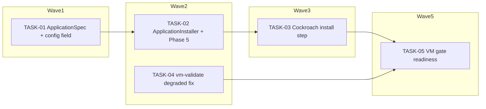

<!-- file: docs/agent-tasks/applications/orchestration.md -->
<!-- version: 1.0.0 -->
<!-- guid: 8ca3f516-e335-42a1-a438-05a26a5a7ddf -->
<!-- last-edited: 2026-07-16 -->

# Orchestration — applications workstream

Read the package-level [`../ORCHESTRATION.md`](../ORCHESTRATION.md) first. This file only adds the workstream-specific wave order. **Wave numbers are GLOBAL across the deploy-system package** — this workstream's tasks interleave with the other four.

## Waves (respect `Depends on:`)



- **Wave 1**: TASK-01 defines `ApplicationSpec` and the `applications` field. Everything else here waits on it.
- **Wave 2**: TASK-02 (`applications.rs` + `installer.rs`) and TASK-04 (`scripts/vm-validate.sh`) touch disjoint files and run concurrently. **TASK-04 has no dependency at all and should be dispatched immediately, ahead of wave 1.**
- **Wave 3**: TASK-03 also edits `applications.rs` and `installer.rs` — it MUST NOT start until TASK-02's PR is merged and its worktree is rebased.
- **Wave 5**: TASK-05 needs BOTH TASK-03 (something to assert) and TASK-04 (a gate that can fail), and also re-edits `scripts/vm-validate.sh`.

## Coordinator protocol (verbatim)

> **Coordinator owns git. Workers never push.** Each worker operates only inside its
> assigned worktree: edit, test, commit — then stop. Workers never run `git push`,
> `gh pr`, or any merge command. The coordinator runs the gate (`cargo test --lib --offline && cargo build --offline`) in each
> finished worktree, opens the PR, merges (rebase/FF unless the repo profile says
> otherwise), and then **rebases every open sibling worktree** before dispatching
> anything else.
>
> **Per-merge sibling-rebase loop:** after EVERY merge to `origin/main`:
> for each open sibling worktree, `git fetch origin && git rebase
> origin/main`. A sibling that skips a rebase is a future conflict.
>
> **Conflict escalation ladder** (in order, never skip a rung): 1) clean rebase;
> 2) conflict-resolver subagent (Sonnet-class, only when the conflict spans 1–3 small
> files); 3) file-copy cherry-pick fallback — re-apply the task’s file states onto a
> fresh branch from HEAD; 4) mark `rebase_blocked`, stop the lane, escalate to a human.
>
> **A wave MUST NOT start** while any of: the previous wave has an unmerged PR; any
> sibling worktree is un-rebased; the gate is red on `origin/main`; or a
> `rebase_blocked` marker is unresolved.

## Run it

```bash
# from docs/agent-tasks/applications/
./run.sh                 # print task list + set up worktrees
./run.sh 04            # dispatch FIRST — P0, independent
./run.sh 01            # wave 1
./run.sh 02            # wave 2 (after 01 merged)
./run.sh 03            # wave 3 (after 02 merged + rebased)
./run.sh 05            # wave 5 (after 03 AND 04 merged)
```

After each wave: gate each worktree with `cargo test --lib --offline && cargo build --offline`, push/PR/merge as coordinator, then rebase every remaining sibling worktree onto `origin/main` before starting the next wave.
