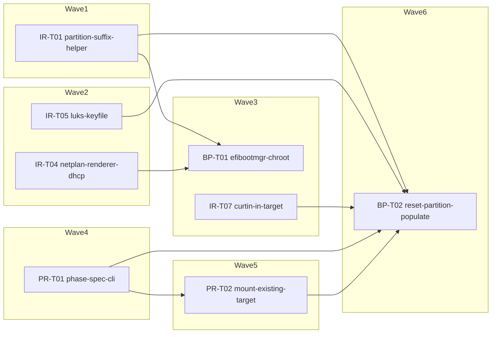

<!-- file: docs/agent-tasks/boot-prod/orchestration.md -->
<!-- version: 1.0.0 -->
<!-- guid: 54c7148e-add2-4c8a-b498-28fb0339f283 -->
<!-- last-edited: 2026-07-09 -->

# boot-prod — orchestration

Wave order for this workstream, within the GLOBAL wave schedule shared by all install-ops
workstreams. Both boot-prod tasks are wave-gated by CROSS-WORKSTREAM same-file collisions —
neither has an intra-workstream dependency on the other.

## Wave order for this workstream

1. **Global waves 1–2 (no boot-prod tasks — wait):** installer-robustness/TASK-01
   (`partition_path` helper; touches `system_setup.rs`, `installer.rs`, `mod.rs`) merges in
   wave 1; installer-robustness/TASK-04 (touches `system_setup.rs`) and
   installer-robustness/TASK-05 (touches `installer.rs`) merge in wave 2.
2. **Global wave 3 — TASK-01 (efibootmgr-chroot):** starts only after waves 1–2 are merged and
   siblings rebased, because it edits `system_setup.rs` (shared with IR-T01 and IR-T04). Runs
   alongside install-server/TASK-03 and installer-robustness/TASK-07 (disjoint files).
3. **Global waves 4–5 (no boot-prod tasks — wait):** phase-rerun/TASK-01 (wave 4) and
   phase-rerun/TASK-02 (wave 5) both edit `installer.rs`, which TASK-02 also edits.
4. **Global wave 6 — TASK-02 (reset-partition-populate):** the LAST task of the whole
   operation. Starts only after wave 5 merges; by then every `installer.rs`/`mod.rs` collider
   (IR-T01/05/07, PR-T01/02) is on `origin/main`, and the `partition_path` helper TASK-02
   reuses is guaranteed present.

A task whose prereq waves are not fully merged does NOT start — no exceptions.

## Protocol (verbatim — do not paraphrase)

> **Coordinator owns git. Workers never push.** Each worker operates only inside its
> assigned worktree: edit, test, commit — then stop. Workers never run `git push`,
> `gh pr`, or any merge command. The coordinator runs the gate (`cargo test --lib --offline && cargo build --offline`) in each
> finished worktree, opens the PR, merges (rebase/FF unless the repo profile says
> otherwise), and then **rebases every open sibling worktree** before dispatching
> anything else.
>
> **Per-merge sibling-rebase loop:** after EVERY merge to `origin/main`:
> for each open sibling worktree, `git fetch origin && git rebase
> origin/main`. A sibling that skips a rebase is a future conflict.
>
> **Conflict escalation ladder** (in order, never skip a rung): 1) clean rebase;
> 2) conflict-resolver subagent (Sonnet-class, only when the conflict spans 1–3 small
> files); 3) file-copy cherry-pick fallback — re-apply the task's file states onto a
> fresh branch from HEAD; 4) mark `rebase_blocked`, stop the lane, escalate to a human.
>
> **A wave MUST NOT start** while any of: the previous wave has an unmerged PR; any
> sibling worktree is un-rebased; the gate is red on `origin/main`; or a
> `rebase_blocked` marker is unresolved.

## Dependency / wave graph

Edges are merge-waits (T1 → T2 means T2 waits for T1's PR to merge), matching the collision
matrix rows for `system_setup.rs`, `installer.rs`, and `mod.rs`. Non-boot-prod tasks appear
only where they gate a boot-prod task.

Legend: IR = installer-robustness, PR = phase-rerun, BP = boot-prod. `IR01 → BP01` and
`IR04 → BP01` are the `system_setup.rs` collisions; `IR01/IR05/IR07/PR01/PR02 → BP02` are the
`installer.rs` (and, for IR01, `mod.rs`) collisions; `PR01 → PR02` is phase-rerun's own
declared dependency + `installer.rs` collision. BP01 and BP02 have no edge between them —
disjoint file sets — but wave numbering still orders them 3 then 6.
