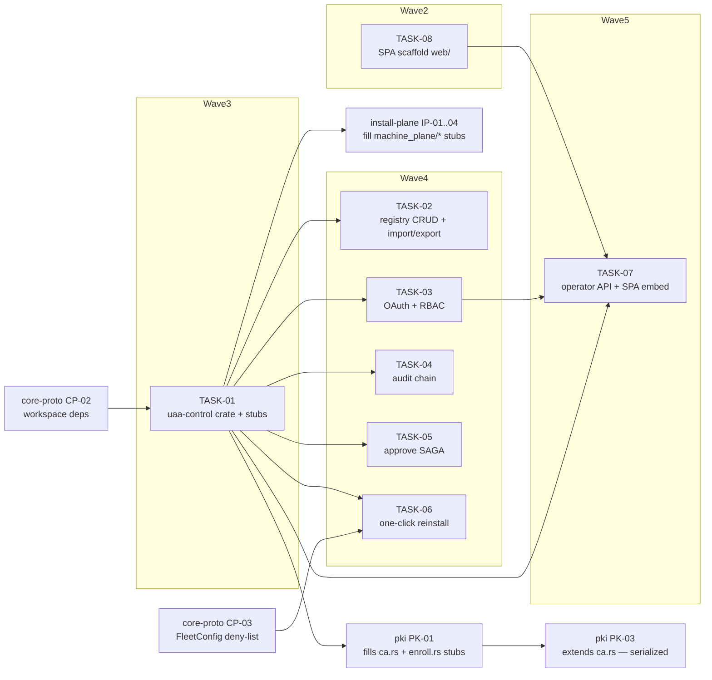

<!-- file: docs/agent-tasks/control/orchestration.md -->
<!-- version: 1.0.0 -->
<!-- guid: 3bf66b21-80d4-4ef7-addf-a23170cba6d8 -->
<!-- last-edited: 2026-07-10 -->

# control — orchestration

Eight-task workstream spanning global waves 2–5 of the constellation plan. Local wave order: TASK-08 (SPA, wave 2) → TASK-01 (crate foundation, wave 3) → TASK-02/03/04/05/06 in parallel (disjoint CT-01 stubs, wave 4) → TASK-07 (wave 5). See [../ORCHESTRATION.md](../ORCHESTRATION.md) for the full coordinator + worker protocol; the blocks below are this workstream's specifics.

## Wave order for this workstream

| Global wave | This WS runs | Must be MERGED first |
|---|---|---|
| 1 | — | core-proto CP-01 (workspace conversion — everything downstream builds on `crates/*`) |
| 2 | **TASK-08** (SPA scaffold, `web/**` only) | wave 1 (CP-01) |
| 3 | **TASK-01** (uaa-control crate + stubs) | wave 2 — specifically core-proto CP-02 (`[workspace.dependencies]` + uaa-proto) |
| 4 | **TASK-02 · TASK-03 · TASK-04 · TASK-05 · TASK-06** (parallel — disjoint stub files) | wave 3 (TASK-01); TASK-06 additionally core-proto CP-03 (FleetConfig deny-list). Cross-WS peers in the same wave: install-plane IP-01..03, pki PK-01 (disjoint uaa-control stubs) |
| 5 | **TASK-07** (operator plane + SPA embed) | wave 4 — TASK-02..06 + PK-01 (handlers it wires) + TASK-03 (`require_role`) + TASK-08's `web/dist/.gitkeep` |

Dispatch rule: the coordinator dispatches a wave only when every listed prerequisite is merged to `origin/main`, the gate is green on `main`, and every open sibling worktree has been rebased.

## Coordinator / worker protocol

> **Coordinator owns git. Workers never push.** Each worker operates only inside its
> assigned worktree: edit, test, commit — then stop. Workers never run `git push`,
> `gh pr`, or any merge command. The coordinator runs the gate (`cargo test --lib --offline && cargo build --offline`) in each
> finished worktree, opens the PR, merges (rebase/FF unless the repo profile says
> otherwise), and then **rebases every open sibling worktree** before dispatching
> anything else.
>
> **Per-merge sibling-rebase loop:** after EVERY merge to `origin/main`:
> for each open sibling worktree, `git fetch origin && git rebase
> origin/main`. A sibling that skips a rebase is a future conflict.
>
> **Conflict escalation ladder** (in order, never skip a rung): 1) clean rebase;
> 2) conflict-resolver subagent (Sonnet-class, only when the conflict spans 1–3 small
> files); 3) file-copy cherry-pick fallback — re-apply the task's file states onto a
> fresh branch from HEAD; 4) mark `rebase_blocked`, stop the lane, escalate to a human.
>
> **A wave MUST NOT start** while any of: the previous wave has an unmerged PR; any
> sibling worktree is un-rebased; the gate is red on `origin/main`; or a
> `rebase_blocked` marker is unresolved.

For TASK-08 the coordinator additionally runs `cd web && npm ci && npm run build` as part of the gate.

## Dependency graph

Edges mean "waits for the upstream task's MERGE" (skeleton depends_on + collision rows). Subgraphs are this workstream's LOCAL waves, labeled with the GLOBAL wave numbers. Nodes outside this workstream (core-proto CP-02/CP-03, pki PK-01/PK-03, install-plane IP-01..04) are shown only where they gate or share files with control tasks.



(`CT08 --> CT07` is the `web/dist/.gitkeep` rust-embed compile dependency; `CT01 --> PK01 --> PK03` is the `ca.rs` collision row — same file, serialized across waves 3/4/5.)

## Run it

```bash
cd docs/agent-tasks/control
./run.sh 08            # global wave 2 — SPA scaffold (after CP-01 merges)
./run.sh 01            # global wave 3 — crate foundation (after CP-02 merges)
./run.sh 02 03 04 05 06  # global wave 4 — parallel stub fills (after TASK-01 + CP-03 merge)
./run.sh 07            # global wave 5 — operator plane (after wave 4 + PK-01 merge)
```
