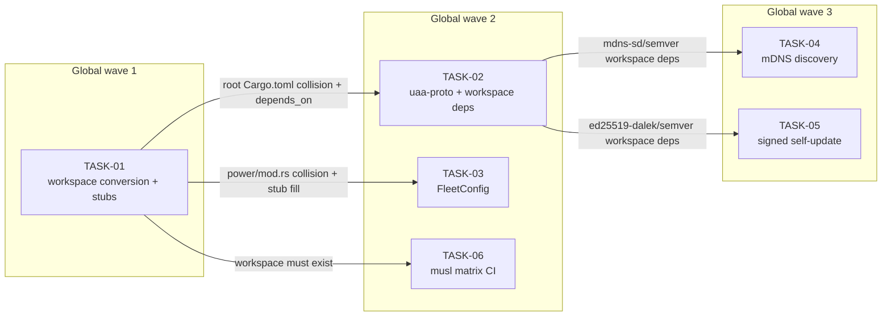

<!-- file: docs/agent-tasks/core-proto/orchestration.md -->
<!-- version: 1.0.0 -->
<!-- guid: a025f440-0d1a-460e-b001-86e8ac3880e3 -->
<!-- last-edited: 2026-07-10 -->

# core-proto — orchestration

Six-task foundation workstream. Local waves map onto GLOBAL constellation waves 1–3; TASK-01 (CP-01) is the wide-collision root of the ENTIRE plan — no task in any workstream dispatches before it merges. See [ORCHESTRATION.md](../ORCHESTRATION.md) (one level up) for the full coordinator + worker protocol.

## Wave order for this workstream

| Global wave | This WS runs | Prereq (must be MERGED first) |
|---|---|---|
| 1 | **TASK-01** (workspace conversion + stubs) — SINGLE AGENT, strong model | none — runs alone, plan-wide |
| 2 | **TASK-02** (proto crate + workspace deps), **TASK-03** (FleetConfig), **TASK-06** (musl matrix) — parallel | wave 1 merged + siblings rebased; TASK-02 is the only root-Cargo.toml editor in the wave |
| 3 | **TASK-04** (discovery), **TASK-05** (self-update) — parallel | wave 2 merged (TASK-02's `mdns-sd`/`semver`/`ed25519-dalek` workspace deps) |

Dispatch rule: the coordinator dispatches a wave only when every prior-wave task above is merged to `origin/main` and the gate is green on `main`; each worker's `git rebase origin/main` in its brief's ⛔ START HERE block then picks up the merged workspace shape. Downstream (not dispatched here): CP-02 additionally gates CT-01/PK-02/WB-01/PX-01, CP-03 gates CT-06/RP-02/RP-03, CP-05 gates WB-04 — the coordinator announces those merges to the other workstreams' lanes.

## Coordinator / worker protocol

> **Coordinator owns git. Workers never push.** Each worker operates only inside its
> assigned worktree: edit, test, commit — then stop. Workers never run `git push`,
> `gh pr`, or any merge command. The coordinator runs the gate (`cargo test --lib --offline && cargo build --offline`) in each
> finished worktree, opens the PR, merges (rebase/FF unless the repo profile says
> otherwise), and then **rebases every open sibling worktree** before dispatching
> anything else.
>
> **Per-merge sibling-rebase loop:** after EVERY merge to `origin/main`:
> for each open sibling worktree, `git fetch origin && git rebase
> origin/main`. A sibling that skips a rebase is a future conflict.
>
> **Conflict escalation ladder** (in order, never skip a rung): 1) clean rebase;
> 2) conflict-resolver subagent (Sonnet-class, only when the conflict spans 1–3 small
> files); 3) file-copy cherry-pick fallback — re-apply the task's file states onto a
> fresh branch from HEAD; 4) mark `rebase_blocked`, stop the lane, escalate to a human.
>
> **A wave MUST NOT start** while any of: the previous wave has an unmerged PR; any
> sibling worktree is un-rebased; the gate is red on `origin/main`; or a
> `rebase_blocked` marker is unresolved.

## Dependency graph

Edges mean "waits for the upstream task's MERGE" (logical `depends_on` and file collisions from the operation matrix). All six nodes are this workstream's; subgraphs are labeled with GLOBAL wave numbers. TASK-02/03/06 are mutually parallel-safe (disjoint files: proto+root manifest vs fleet/place/verify/power vs workflow yml), as are TASK-04/05 (discovery.rs vs update.rs).



## Run it

```bash
cd docs/agent-tasks/core-proto
./run.sh 01          # wave 1 — single strong-model agent; merge before anything else anywhere
./run.sh 02 03 06    # wave 2 — parallel dispatch after wave 1 merges + siblings rebase
./run.sh 04 05       # wave 3 — parallel dispatch after wave 2 merges
```
