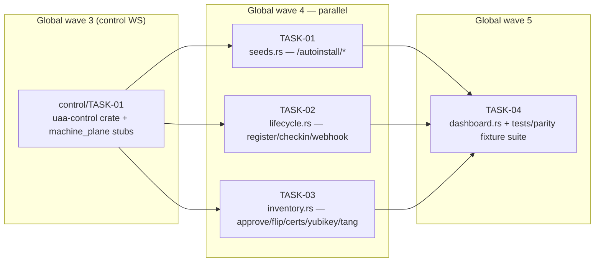

<!-- file: docs/agent-tasks/install-plane/orchestration.md -->
<!-- version: 1.0.0 -->
<!-- guid: 75521610-dbef-4c86-88e8-4a905ddf499a -->
<!-- last-edited: 2026-07-10 -->

# install-plane — orchestration

Four-task workstream in **global waves 4 and 5** of the constellation plan. See [ORCHESTRATION.md](../ORCHESTRATION.md) (one level up) for the full coordinator + worker protocol; the wave order below is this workstream's slice of the skeleton's global waves.

## Wave order for this workstream

| Global wave | This WS runs | Must be MERGED first |
|---|---|---|
| 1–3 | — | `core-proto/TASK-01` (CP-01, workspace transform), then `control/TASK-01` (CT-01, wave 3 — creates `crates/uaa-control` + the `machine_plane/{seeds,lifecycle,inventory,dashboard}.rs` stubs) |
| 4 | **TASK-01 + TASK-02 + TASK-03** (parallel — disjoint stub files, each the exactly-one filler of its stub) | CT-01 merged + gate green on main |
| 5 | **TASK-04** (parity fixtures + dashboard) | TASK-01, TASK-02, TASK-03 all merged |

## Dependency graph

Edges mean "waits for the upstream task's MERGE" (skeleton `depends_on` + the stub-pattern collision row). `CT01` belongs to the control workstream and is shown only because it gates this one. Subgraph labels carry the GLOBAL wave numbers.



## Coordinator / worker protocol

> **Coordinator owns git. Workers never push.** Each worker operates only inside its
> assigned worktree: edit, test, commit — then stop. Workers never run `git push`,
> `gh pr`, or any merge command. The coordinator runs the gate (`cargo test --lib --offline && cargo build --offline`) in each
> finished worktree, opens the PR, merges (rebase/FF unless the repo profile says
> otherwise), and then **rebases every open sibling worktree** before dispatching
> anything else.
>
> **Per-merge sibling-rebase loop:** after EVERY merge to `origin/main`:
> for each open sibling worktree, `git fetch origin && git rebase
> origin/main`. A sibling that skips a rebase is a future conflict.
>
> **Conflict escalation ladder** (in order, never skip a rung): 1) clean rebase;
> 2) conflict-resolver subagent (Sonnet-class, only when the conflict spans 1–3 small
> files); 3) file-copy cherry-pick fallback — re-apply the task's file states onto a
> fresh branch from HEAD; 4) mark `rebase_blocked`, stop the lane, escalate to a human.
>
> **A wave MUST NOT start** while any of: the previous wave has an unmerged PR; any
> sibling worktree is un-rebased; the gate is red on `origin/main`; or a
> `rebase_blocked` marker is unresolved.

## Run it

```bash
# Global wave 4 — after CT-01 is merged and the gate is green on main:
./run.sh 01 02 03

# Global wave 5 — after TASK-01/02/03 are all merged and siblings rebased:
./run.sh 04
```
