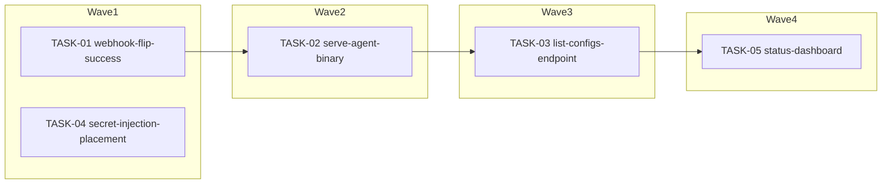

<!-- file: docs/agent-tasks/install-server/orchestration.md -->
<!-- version: 1.0.0 -->
<!-- guid: 3b4bb2ac-1d04-4142-a172-15a4de14de06 -->
<!-- last-edited: 2026-07-09 -->

# install-server — orchestration

Wave schedule and merge protocol for the five `TASK-*.md` briefs in this directory. Wave numbers are GLOBAL across the install-ops operation: the coordinator merges an entire global wave (all workstreams) before starting the next, so this workstream's later tasks also wait on other workstreams' same-wave PRs.

## Wave order for this workstream

| Global wave | install-server tasks | Waits for | Shares the wave with (other workstreams) |
|---|---|---|---|
| 1 | TASK-01 (webhook-flip-success), TASK-04 (secret-injection-placement) | nothing — first wave | installer-robustness 01/02/06/08, testing-gates 02 |
| 2 | TASK-02 (serve-agent-binary) | wave 1 fully merged + siblings rebased (TASK-01 edits the same `scripts/autoinstall-agent.py`) | installer-robustness 03/04/05, testing-gates 01 |
| 3 | TASK-03 (list-configs-endpoint) | wave 2 fully merged + siblings rebased (same-file serialization after TASK-02) | installer-robustness 07, boot-prod 01 |
| 4 | TASK-05 (status-dashboard) | wave 3 fully merged + siblings rebased (same-file serialization; calls TASK-02's `agent_binary_status` and TASK-03's `collect_uaa_configs`) | phase-rerun 01 |
| 5–6 | (none — this workstream is finished after wave 4) | — | phase-rerun 02, remote-power 01, boot-prod 02 |

Dependency chain inside this workstream: TASK-01 → TASK-02 → TASK-03 → TASK-05 (all file-collision serialization on `scripts/autoinstall-agent.py`); TASK-04 depends on nothing.

## Protocol (verbatim — do not paraphrase)

> **Coordinator owns git. Workers never push.** Each worker operates only inside its
> assigned worktree: edit, test, commit — then stop. Workers never run `git push`,
> `gh pr`, or any merge command. The coordinator runs the gate (`cargo test --lib --offline && cargo build --offline`) in each
> finished worktree, opens the PR, merges (rebase/FF unless the repo profile says
> otherwise), and then **rebases every open sibling worktree** before dispatching
> anything else.
>
> **Per-merge sibling-rebase loop:** after EVERY merge to `origin/main`:
> for each open sibling worktree, `git fetch origin && git rebase
> origin/main`. A sibling that skips a rebase is a future conflict.
>
> **Conflict escalation ladder** (in order, never skip a rung): 1) clean rebase;
> 2) conflict-resolver subagent (Sonnet-class, only when the conflict spans 1–3 small
> files); 3) file-copy cherry-pick fallback — re-apply the task's file states onto a
> fresh branch from HEAD; 4) mark `rebase_blocked`, stop the lane, escalate to a human.
>
> **A wave MUST NOT start** while any of: the previous wave has an unmerged PR; any
> sibling worktree is un-rebased; the gate is red on `origin/main`; or a
> `rebase_blocked` marker is unresolved.

Workstream-specific gate note: in addition to the cargo gate above, the coordinator runs `python3 -m py_compile scripts/autoinstall-agent.py` for TASK-01/02/03/05 and `bash -n scripts/deploy-usb-configs.sh` for TASK-04 before merging.

## Dependency graph

Edges mean "waits for the merge of" — no edge means parallel-safe, which matches the collision matrix (TASK-04 shares no file with anything).



## Post-merge (HUMAN, outside this plan)

Merged mirror changes are inert until a human deploys them — never an agent action:

```bash
scp scripts/autoinstall-agent.py 172.16.2.30:/var/www/html/cloud-init/scripts/autoinstall-agent.py
ssh 172.16.2.30 'sudo systemctl restart autoinstall-agent'
curl -s http://172.16.2.30:25000/api/health | python3 -m json.tool   # after TASK-02 lands
```

`scripts/deploy-usb-configs.sh` likewise runs ON the server as a human; copy the updated script there the same way (no service restart needed for it).
