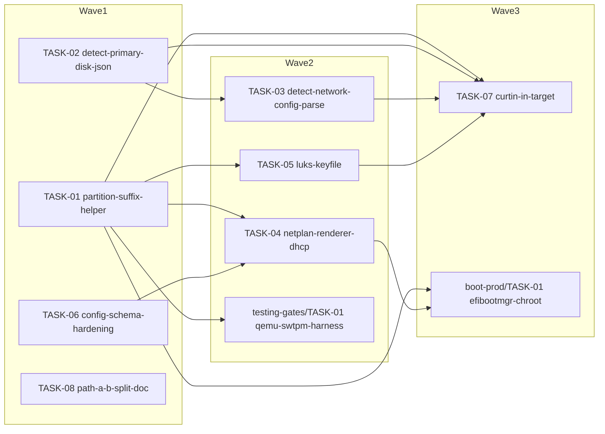

<!-- file: docs/agent-tasks/installer-robustness/orchestration.md -->
<!-- version: 1.0.0 -->
<!-- guid: f30bd0ed-e14c-4f08-a158-c41dfc1dbe55 -->
<!-- last-edited: 2026-07-09 -->

# installer-robustness — orchestration

Wave order for this workstream (wave numbers are GLOBAL across the install-ops operation; the
skeleton in `docs/agent-tasks/` is the source of truth):

1. **Wave 1** — TASK-01 (partition-suffix-helper), TASK-02 (detect-primary-disk-json),
   TASK-06 (config-schema-hardening), TASK-08 (path-a-b-split-doc). All four run in parallel:
   disjoint file sets. Wave 1 also carries install-server/TASK-01, install-server/TASK-04, and
   testing-gates/TASK-02 from other workstreams (no shared files with this WS).
2. **Wave 2** — TASK-03 (detect-network-config-parse), TASK-04 (netplan-renderer-dhcp),
   TASK-05 (luks-keyfile). Starts only after every wave-1 PR is merged and siblings rebased.
   Cross-WS: testing-gates/TASK-01 (QEMU+swtpm gate) also runs in wave 2 and **waits on
   TASK-01's merge** (the /dev/vda suffix fix). **Merge caution:** TASK-04's new
   `InstallationConfig` field compiler-forces a one-line initializer in `src/cli/commands.rs`
   (TASK-03's file) and in a `#[cfg(test)]` literal in `installer.rs` (TASK-05's file) —
   merge the three wave-2 PRs one at a time, rebasing the remaining wave-2 worktrees after each
   merge.
3. **Wave 3** — TASK-07 (curtin-in-target). Waits for waves 1–2 (shares
   `src/cli/commands.rs` with TASK-02/03 and `installer.rs` with TASK-01/05). Cross-WS: wave 3
   also runs boot-prod/TASK-01 (edits `system_setup.rs` — safe, TASK-01/04 merged) and
   install-server/TASK-03 (no shared files).

After wave 3, this workstream is complete. Later global waves (4–6: phase-rerun, remote-power,
install-server/TASK-05, boot-prod/TASK-02) re-enter `src/cli/commands.rs`,
`installer.rs`, `disk_ops.rs`, `zfs_ops.rs`, and `mod.rs` — they must not start until this
workstream's PRs are all merged.

## Protocol

> **Coordinator owns git. Workers never push.** Each worker operates only inside its
> assigned worktree: edit, test, commit — then stop. Workers never run `git push`,
> `gh pr`, or any merge command. The coordinator runs the gate (`cargo test --lib --offline && cargo build --offline`) in each
> finished worktree, opens the PR, merges (rebase/FF unless the repo profile says
> otherwise), and then **rebases every open sibling worktree** before dispatching
> anything else.
>
> **Per-merge sibling-rebase loop:** after EVERY merge to `origin/main`:
> for each open sibling worktree, `git fetch origin && git rebase
> origin/main`. A sibling that skips a rebase is a future conflict.
>
> **Conflict escalation ladder** (in order, never skip a rung): 1) clean rebase;
> 2) conflict-resolver subagent (Sonnet-class, only when the conflict spans 1–3 small
> files); 3) file-copy cherry-pick fallback — re-apply the task's file states onto a
> fresh branch from HEAD; 4) mark `rebase_blocked`, stop the lane, escalate to a human.
>
> **A wave MUST NOT start** while any of: the previous wave has an unmerged PR; any
> sibling worktree is un-rebased; the gate is red on `origin/main`; or a
> `rebase_blocked` marker is unresolved.

## Dependency graph

Edges mean "waits for the merge of" (same-file collision or declared dependency). No edge =
parallel-safe per the collision matrix.

(`testing-gates/TASK-01` and `boot-prod/TASK-01` are shown for the cross-workstream waits this
WS creates; their briefs live in their own workstream directories.)
