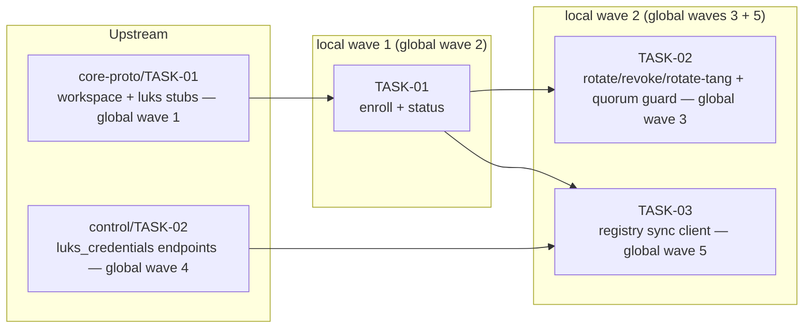

<!-- file: docs/agent-tasks/luks-keys/orchestration.md -->
<!-- version: 1.0.0 -->
<!-- guid: 7c994665-ac1b-468a-9afc-f75a64137fea -->
<!-- last-edited: 2026-07-10 -->

# luks-keys — orchestration

Three-task workstream in SERIAL WAVES. See [../ORCHESTRATION.md](../ORCHESTRATION.md) for the full coordinator + worker protocol; the wave order below is this workstream's slice of the plan's GLOBAL waves.

## Wave order for this workstream

| Global wave | This WS runs | Must be MERGED first |
|---|---|---|
| 1 | — | `core-proto/TASK-01` (CP-01) — creates the `crates/uaa-core/src/luks_keys.rs` + `luks_sync.rs` stubs (collision row: CP-01 → LK-01 → LK-02 on `luks_keys.rs`) |
| 2 | **TASK-01** (enroll + status) | CP-01 |
| 3 | **TASK-02** (rotate/revoke/rotate-tang + quorum guard) | TASK-01 (same file — collision-row serialization AND logical dependency: rotate calls `enroll_fido2`) |
| 4 | — | `control/TASK-02` (CT-02) — `luks_credentials`/tang endpoints on the control registry |
| 5 | **TASK-03** (registry sync client) | TASK-01 (state-file contract) + CT-02 (endpoint exists) |

Dispatch rule: the coordinator dispatches each task only when every upstream row above is merged to `origin/main` and the gate is green on `main`; the worker's `git rebase origin/main` in the brief's ⛔ START HERE block then picks up the merged shape of `luks_keys.rs`. TASK-02 and TASK-03 are the second LOCAL wave (`[LK-02, LK-03]`) and are file-disjoint, but TASK-03 additionally waits for its global wave-5 prereq CT-02 — in practice TASK-02 usually dispatches first (wave 3) and TASK-03 later (wave 5).

## Coordinator / worker protocol

> **Coordinator owns git. Workers never push.** Each worker operates only inside its
> assigned worktree: edit, test, commit — then stop. Workers never run `git push`,
> `gh pr`, or any merge command. The coordinator runs the gate (`cargo test --lib --offline && cargo build --offline`) in each
> finished worktree, opens the PR, merges (rebase/FF unless the repo profile says
> otherwise), and then **rebases every open sibling worktree** before dispatching
> anything else.
>
> **Per-merge sibling-rebase loop:** after EVERY merge to `origin/main`:
> for each open sibling worktree, `git fetch origin && git rebase
> origin/main`. A sibling that skips a rebase is a future conflict.
>
> **Conflict escalation ladder** (in order, never skip a rung): 1) clean rebase;
> 2) conflict-resolver subagent (Sonnet-class, only when the conflict spans 1–3 small
> files); 3) file-copy cherry-pick fallback — re-apply the task's file states onto a
> fresh branch from HEAD; 4) mark `rebase_blocked`, stop the lane, escalate to a human.
>
> **A wave MUST NOT start** while any of: the previous wave has an unmerged PR; any
> sibling worktree is un-rebased; the gate is red on `origin/main`; or a
> `rebase_blocked` marker is unresolved.

## Dependency graph

Edges mean "waits for the upstream task's MERGE" (collision rows + `depends_on`). Nodes outside this workstream (CP-01, CT-02) are shown because they gate it. Subgraphs are this workstream's LOCAL waves, labeled with the GLOBAL wave numbers.



No edge between LK02 and LK03 — disjoint files (`luks_keys.rs` vs `luks_sync.rs`), parallel-safe once each one's own prereqs are merged.

## Run it

```bash
# local wave 1 (global wave 2, after CP-01 merges):
./run.sh 01
# local wave 2 (global wave 3, after TASK-01 merges):
./run.sh 02
# global wave 5 (after CT-02 merges):
./run.sh 03
```
