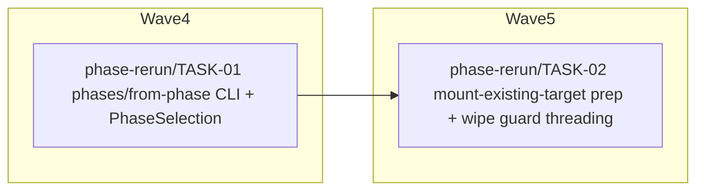

<!-- file: docs/agent-tasks/phase-rerun/orchestration.md -->
<!-- version: 1.0.0 -->
<!-- guid: 8df5f71e-0b1c-40e7-928e-77b8529311d4 -->
<!-- last-edited: 2026-07-09 -->

# phase-rerun — orchestration

Coordinator playbook for the phase-rerun workstream (2 tasks, both Opus-class ⚠ review-critical). Spec: `docs/specs/phase-selective-rerun-design.md` + `docs/specs/phase-selective-rerun-plan.md`. Workstream overview: [README.md](README.md).

## Wave order for this workstream

Waves are GLOBAL waves from the install-ops skeleton. This workstream owns one task in each of waves 4 and 5 and must WAIT for earlier global waves because they rework the same files:

1. **Before wave 4 starts:** global waves 1–3 fully merged + all sibling worktrees rebased. This workstream rebases onto: installer-robustness/TASK-01 (partition-suffix helper — `installer.rs`, `disk_ops.rs`, `zfs_ops.rs`, w1), installer-robustness/TASK-02 (`commands.rs`, w1), installer-robustness/TASK-03 (`commands.rs`, w2), installer-robustness/TASK-05 (LUKS keyfile — `disk_ops.rs`, `installer.rs`, w2), installer-robustness/TASK-07 (`installer.rs`, `commands.rs`, w3).
2. **Wave 4:** dispatch `TASK-01-phase-spec-cli.md` (worktree `phase-rerun-phase-spec-cli`). Runs in parallel with install-server/TASK-05 (disjoint files). Merge gate green → merge → rebase all open siblings.
3. **Wave 5:** dispatch `TASK-02-mount-existing-target.md` (worktree `phase-rerun-mount-existing-target`) only after TASK-01 is merged (hard dependency: `PhaseSelection` / `WipeAuthorization` types) and siblings rebased. Runs in parallel with remote-power/TASK-01 (disjoint files — remote-power was pushed to wave 5 precisely because it collides with TASK-01's `args.rs`/`main.rs`/`commands.rs`, not with TASK-02).
4. **After wave 5:** boot-prod/TASK-02 (global wave 6) touches `installer.rs` next — do not let it start until TASK-02 is merged and it has rebased.

Review note: both tasks are wipe-adjacent. The coordinator MUST review the anti-over-suppression acceptance items (default full install still wipes + installs) before merging either PR, and must confirm `cargo test --lib --offline` shows the 237 baseline tests still passing untouched.

## Protocol (verbatim)

> **Coordinator owns git. Workers never push.** Each worker operates only inside its
> assigned worktree: edit, test, commit — then stop. Workers never run `git push`,
> `gh pr`, or any merge command. The coordinator runs the gate (`cargo test --lib --offline && cargo build --offline`) in each
> finished worktree, opens the PR, merges (rebase/FF unless the repo profile says
> otherwise), and then **rebases every open sibling worktree** before dispatching
> anything else.
>
> **Per-merge sibling-rebase loop:** after EVERY merge to `origin/main`:
> for each open sibling worktree, `git fetch origin && git rebase
> origin/main`. A sibling that skips a rebase is a future conflict.
>
> **Conflict escalation ladder** (in order, never skip a rung): 1) clean rebase;
> 2) conflict-resolver subagent (Sonnet-class, only when the conflict spans 1–3 small
> files); 3) file-copy cherry-pick fallback — re-apply the task's file states onto a
> fresh branch from HEAD; 4) mark `rebase_blocked`, stop the lane, escalate to a human.
>
> **A wave MUST NOT start** while any of: the previous wave has an unmerged PR; any
> sibling worktree is un-rebased; the gate is red on `origin/main`; or a
> `rebase_blocked` marker is unresolved.

## Dependency graph

Edges mean "waits for the merge of" (matches the collision matrix: TASK-01 → TASK-02 share `src/network/ssh_installer/installer.rs` AND TASK-02 depends on TASK-01's types).

(Cross-workstream waits not drawn: T01 additionally waits for global waves 1–3 as listed above; boot-prod/TASK-02 in global wave 6 waits for T02.)
