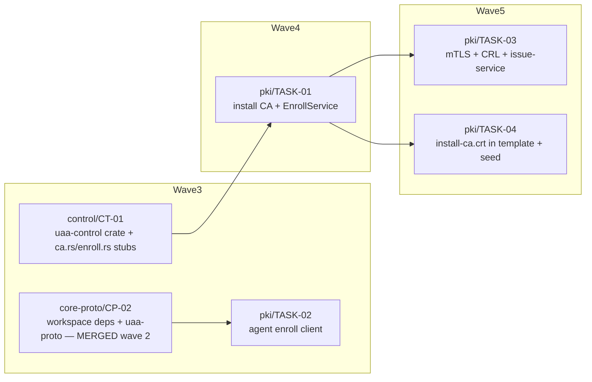

<!-- file: docs/agent-tasks/pki/orchestration.md -->
<!-- version: 1.0.0 -->
<!-- guid: 0433d82b-85fb-46a3-9977-b7ec6b2222d0 -->
<!-- last-edited: 2026-07-10 -->

# pki — orchestration

Four-task workstream spanning GLOBAL waves 3–5 of the constellation plan. Ordering is driven by the `crates/uaa-control/src/ca.rs` collision row (CT-01 stub → PK-01 → PK-03) and stub-fill dependencies (CP-01/CP-02 create what PK-02 fills; CT-01 creates what PK-01 fills). See [../ORCHESTRATION.md](../ORCHESTRATION.md) for the full coordinator + worker protocol.

## Wave order for this workstream

| Global wave | This WS runs | Must be MERGED first (cross-workstream) |
|---|---|---|
| 1–2 | — | CP-01 (workspace + stubs, wave 1); CP-02 (workspace deps + uaa-proto, wave 2) |
| 3 | **TASK-02** (agent enroll client) | CP-02 — runs alongside CT-01 and the other wave-3 tasks (disjoint files) |
| 4 | **TASK-01** (install CA + EnrollService) | CT-01 (creates `crates/uaa-control` + the `ca.rs`/`enroll.rs` stubs) |
| 5 | **TASK-03** (mTLS + CRL + issue-service) · **TASK-04** (CA cert in seed) | TASK-01 merged (ca.rs collision row for TASK-03; CA existence for TASK-04). TASK-03 ∥ TASK-04 — disjoint files |

Dispatch rule: the coordinator dispatches each task only when its gating merges are on `origin/main` and the gate is green there; the worker's `git rebase origin/main` in the brief's ⛔ START HERE block then picks up the final stub/ca.rs shape.

## Coordinator / worker protocol

> **Coordinator owns git. Workers never push.** Each worker operates only inside its
> assigned worktree: edit, test, commit — then stop. Workers never run `git push`,
> `gh pr`, or any merge command. The coordinator runs the gate (`cargo test --lib --offline && cargo build --offline`) in each
> finished worktree, opens the PR, merges (rebase/FF unless the repo profile says
> otherwise), and then **rebases every open sibling worktree** before dispatching
> anything else.
>
> **Per-merge sibling-rebase loop:** after EVERY merge to `origin/main`:
> for each open sibling worktree, `git fetch origin && git rebase
> origin/main`. A sibling that skips a rebase is a future conflict.
>
> **Conflict escalation ladder** (in order, never skip a rung): 1) clean rebase;
> 2) conflict-resolver subagent (Sonnet-class, only when the conflict spans 1–3 small
> files); 3) file-copy cherry-pick fallback — re-apply the task's file states onto a
> fresh branch from HEAD; 4) mark `rebase_blocked`, stop the lane, escalate to a human.
>
> **A wave MUST NOT start** while any of: the previous wave has an unmerged PR; any
> sibling worktree is un-rebased; the gate is red on `origin/main`; or a
> `rebase_blocked` marker is unresolved.

## Dependency graph

Edges mean "waits for the upstream task's MERGE" (depends_on + the ca.rs collision row). Nodes outside this workstream (CP-01/CP-02/CT-01) gate it and are shown for that reason. No edge between `PK03` and `PK04` — parallel-safe (disjoint files); no edge between `PK02` and `PK01` — parallel-safe by files, placed in adjacent waves by their own gates.



## Run it

```bash
cd docs/agent-tasks/pki
./run.sh 02        # wave 3 — agent enroll client (after CP-02 merged)
./run.sh 01        # wave 4 — install CA + EnrollService (after CT-01 merged)
./run.sh 03 04     # wave 5 — mTLS/CRL + seed embedding, parallel (after TASK-01 merged)
```
