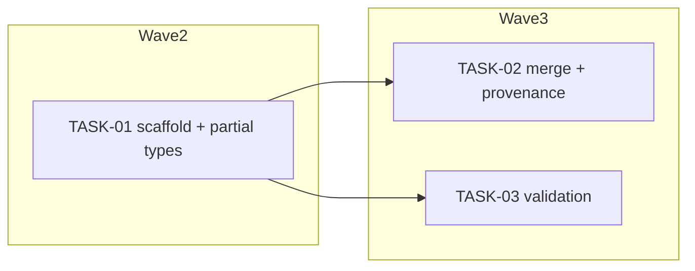

<!-- file: docs/agent-tasks/profiles/orchestration.md -->
<!-- version: 1.0.0 -->
<!-- guid: 47559a64-4be5-42f0-8081-0b6b4ad687ee -->
<!-- last-edited: 2026-07-16 -->

# Orchestration — profiles workstream

Read the package-level [`../ORCHESTRATION.md`](../ORCHESTRATION.md) first. This file only adds the workstream-specific wave order. **Wave numbers are GLOBAL across the deploy-system package** — this workstream's tasks interleave with the other four.

## Waves (respect `Depends on:`)



- **Wave 2**: TASK-01 creates `profile/mod.rs` (types + `pub mod` declarations) and the two empty stubs. It depends on DS-APP-01 (wave 1), which defines `ApplicationSpec`.
- **Wave 3** (parallel): TASK-02 fills `merge.rs`, TASK-03 fills `validate.rs`. **Disjoint files — they run concurrently** and need no rebase against each other. Neither may re-edit `mod.rs`.

## Coordinator protocol (verbatim)

> **Coordinator owns git. Workers never push.** Each worker operates only inside its
> assigned worktree: edit, test, commit — then stop. Workers never run `git push`,
> `gh pr`, or any merge command. The coordinator runs the gate (`cargo test --lib --offline && cargo build --offline`) in each
> finished worktree, opens the PR, merges (rebase/FF unless the repo profile says
> otherwise), and then **rebases every open sibling worktree** before dispatching
> anything else.
>
> **Per-merge sibling-rebase loop:** after EVERY merge to `origin/main`:
> for each open sibling worktree, `git fetch origin && git rebase
> origin/main`. A sibling that skips a rebase is a future conflict.
>
> **Conflict escalation ladder** (in order, never skip a rung): 1) clean rebase;
> 2) conflict-resolver subagent (Sonnet-class, only when the conflict spans 1–3 small
> files); 3) file-copy cherry-pick fallback — re-apply the task’s file states onto a
> fresh branch from HEAD; 4) mark `rebase_blocked`, stop the lane, escalate to a human.
>
> **A wave MUST NOT start** while any of: the previous wave has an unmerged PR; any
> sibling worktree is un-rebased; the gate is red on `origin/main`; or a
> `rebase_blocked` marker is unresolved.

## Run it

```bash
# from docs/agent-tasks/profiles/
./run.sh                 # print task list + set up worktrees
./run.sh 01            # wave 2 (after DS-APP-01 merged)
./run.sh 02 03         # wave 3 — parallel, disjoint stub files
```

After each wave: gate each worktree with `cargo test --lib --offline && cargo build --offline`, push/PR/merge as coordinator, then rebase every remaining sibling worktree onto `origin/main` before starting the next wave.
