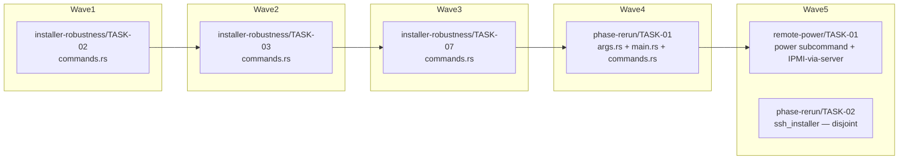

<!-- file: docs/agent-tasks/remote-power/orchestration.md -->
<!-- version: 1.0.0 -->
<!-- guid: b91e9a4c-20d2-46b3-806f-761e133d7ec5 -->
<!-- last-edited: 2026-07-09 -->

# remote-power — orchestration

Single-task workstream. `remote-power/TASK-01` sits in **global wave 5** of the install-ops plan; its only ordering constraints are cross-workstream file collisions, not logical dependencies (`Depends on: none`).

## Wave order for this workstream

| Global wave | This WS runs | Must be MERGED first (cross-workstream, collision-driven) |
|---|---|---|
| 1 | — | `installer-robustness/TASK-02` (shares `src/cli/commands.rs`) |
| 2 | — | `installer-robustness/TASK-03` (shares `src/cli/commands.rs`) |
| 3 | — | `installer-robustness/TASK-07` (shares `src/cli/commands.rs`) |
| 4 | — | `phase-rerun/TASK-01` (shares `src/cli/args.rs`, `src/main.rs`, `src/cli/commands.rs`) |
| 5 | **TASK-01** (power subcommand + IPMI-via-server) | — runs alongside `phase-rerun/TASK-02` (disjoint files: ssh_installer vs power/CLI wiring) |

Dispatch rule: the coordinator dispatches TASK-01 only when every colliding wave-≤4 task above is merged to `origin/main` and the gate is green on `main`; the worker's `git rebase origin/main` in the brief's ⛔ START HERE block then picks up the final shape of the three shared CLI files.

## Coordinator / worker protocol

> **Coordinator owns git. Workers never push.** Each worker operates only inside its
> assigned worktree: edit, test, commit — then stop. Workers never run `git push`,
> `gh pr`, or any merge command. The coordinator runs the gate (`cargo test --lib --offline && cargo build --offline`) in each
> finished worktree, opens the PR, merges (rebase/FF unless the repo profile says
> otherwise), and then **rebases every open sibling worktree** before dispatching
> anything else.
>
> **Per-merge sibling-rebase loop:** after EVERY merge to `origin/main`:
> for each open sibling worktree, `git fetch origin && git rebase
> origin/main`. A sibling that skips a rebase is a future conflict.
>
> **Conflict escalation ladder** (in order, never skip a rung): 1) clean rebase;
> 2) conflict-resolver subagent (Sonnet-class, only when the conflict spans 1–3 small
> files); 3) file-copy cherry-pick fallback — re-apply the task's file states onto a
> fresh branch from HEAD; 4) mark `rebase_blocked`, stop the lane, escalate to a human.
>
> **A wave MUST NOT start** while any of: the previous wave has an unmerged PR; any
> sibling worktree is un-rebased; the gate is red on `origin/main`; or a
> `rebase_blocked` marker is unresolved.

## Dependency graph

Edges mean "waits for the upstream task's MERGE" (file collisions from the operation matrix). Nodes outside Wave5 belong to other workstreams and are shown only because they gate this one. No edge between `RP01` and `PR02` — they are parallel-safe (disjoint files).

