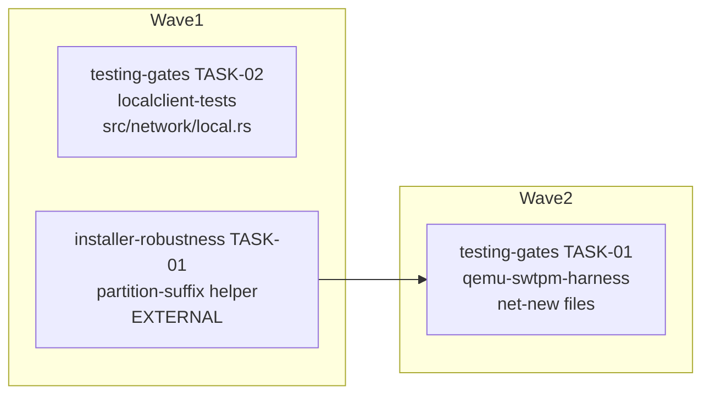

<!-- file: docs/agent-tasks/testing-gates/orchestration.md -->
<!-- version: 1.0.0 -->
<!-- guid: a002e635-cace-41b4-8c80-1531cd825ce0 -->
<!-- last-edited: 2026-07-09 -->

# testing-gates — orchestration

Coordinator playbook for the `testing-gates` workstream (2 tasks). Waves below are the
GLOBAL install-ops waves — this workstream occupies waves 1 and 2 and must respect the
cross-workstream merge it waits on.

## Wave order for this workstream

1. **Global wave 1 — TASK-02 (localclient-tests).** No dependencies; single file
   `src/network/local.rs` collides with nothing in the operation. Dispatch alongside the
   other wave-1 tasks (`install-server/TASK-01`, `install-server/TASK-04`,
   `installer-robustness/TASK-01`, `installer-robustness/TASK-02`,
   `installer-robustness/TASK-06`, `installer-robustness/TASK-08`).
2. **Global wave 2 — TASK-01 (qemu-swtpm-harness).** HARD dependency on
   `installer-robustness/TASK-01` (partition-suffix helper, wave 1). Do NOT dispatch
   TASK-01 until that PR is merged to `origin/main` and sibling worktrees are rebased —
   the harness's VM install fails in Phase 2 (`mkfs` on nonexistent `/dev/vdap1`) against
   pre-helper code, so dispatching early produces a false-negative gate. TASK-01's brief
   contains a mechanical merged-check (`grep -rn 'sdap' src --include='*.rs'` must return
   0 hits post-merge).

Note the counter-intuitive numbering: TASK-02 executes before TASK-01. TASK-01 files are
all net-new, so its wave-2 slot is a functional wait, not a file collision.

**After TASK-01 merges, the workstream's deliverable is the runnable gate, not a passed
gate:** an operator must still run `sudo ./scripts/vm-validate.sh` on a Linux host (the
server 172.16.2.30 or any amd64 Linux box — macOS lacks KVM) and see `GATE: PASS` before
any hardware attempt. THIS SCRIPT PASSING IS THE GATE — no hardware attempt or
len-serv-003 wipe before it passes.

## Protocol (verbatim — do not paraphrase)

> **Coordinator owns git. Workers never push.** Each worker operates only inside its
> assigned worktree: edit, test, commit — then stop. Workers never run `git push`,
> `gh pr`, or any merge command. The coordinator runs the gate (`cargo test --lib --offline && cargo build --offline`) in each
> finished worktree, opens the PR, merges (rebase/FF unless the repo profile says
> otherwise), and then **rebases every open sibling worktree** before dispatching
> anything else.
>
> **Per-merge sibling-rebase loop:** after EVERY merge to `origin/main`:
> for each open sibling worktree, `git fetch origin && git rebase
> origin/main`. A sibling that skips a rebase is a future conflict.
>
> **Conflict escalation ladder** (in order, never skip a rung): 1) clean rebase;
> 2) conflict-resolver subagent (Sonnet-class, only when the conflict spans 1–3 small
> files); 3) file-copy cherry-pick fallback — re-apply the task's file states onto a
> fresh branch from HEAD; 4) mark `rebase_blocked`, stop the lane, escalate to a human.
>
> **A wave MUST NOT start** while any of: the previous wave has an unmerged PR; any
> sibling worktree is un-rebased; the gate is red on `origin/main`; or a
> `rebase_blocked` marker is unresolved.

## Dependency graph

Edges mean "waits for merge of". `IR01` is external to this workstream
(`installer-robustness/TASK-01`, shown for the cross-workstream wait); no edge between
TG02 and TG01 because their file sets are disjoint.

