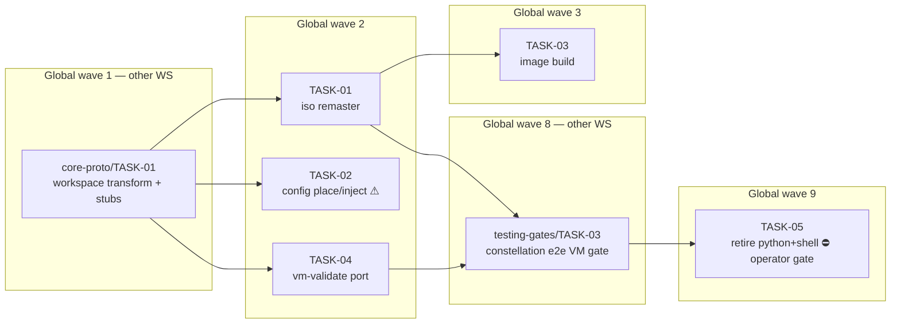

<!-- file: docs/agent-tasks/tooling-port/orchestration.md -->
<!-- version: 1.0.0 -->
<!-- guid: 64f7cdda-a0c6-4887-ad90-789580a203e7 -->
<!-- last-edited: 2026-07-10 -->

# tooling-port — orchestration

Five-task workstream across three LOCAL waves, mapped to GLOBAL waves 2, 3, and 9 of the constellation plan. Full coordinator + worker protocol: [../ORCHESTRATION.md](../ORCHESTRATION.md). Skeleton exec mode: "PARALLEL DISPATCH within wave — TP-01/02/04 disjoint; TP-03 after TP-01; TP-05 hard-gated removal".

## Wave order for this workstream

| Global wave | This WS runs | Must be MERGED first |
|---|---|---|
| 1 | — | `core-proto/TASK-01` (CP-01 workspace transform creates every stub this WS fills) |
| 2 | **TASK-01, TASK-02, TASK-04** (parallel — disjoint CP-01 stubs) | CP-01; siblings rebased |
| 3 | **TASK-03** | TASK-01 (shared `crates/uaa-core/src/iso/` module) |
| 9 | **TASK-05** (removal) | `testing-gates/TASK-03` (TG-03 e2e gate) **+ ⛔ operator-confirmed M6 cutover + 2-week window (Bucket-3 gate — never dispatch on green CI alone)** |

Dispatch rule: the coordinator dispatches wave-2 tasks only when CP-01 is merged to `origin/main` and the gate is green on `main`; each worker's `git rebase origin/main` in the ⛔ START HERE block then sees the stub files. TASK-03 dispatches only after TASK-01's merge. TASK-05 dispatches only with the operator's explicit written confirmation in hand.

## Coordinator / worker protocol

> **Coordinator owns git. Workers never push.** Each worker operates only inside its
> assigned worktree: edit, test, commit — then stop. Workers never run `git push`,
> `gh pr`, or any merge command. The coordinator runs the gate (`cargo test --lib --offline && cargo build --offline`) in each
> finished worktree, opens the PR, merges (rebase/FF unless the repo profile says
> otherwise), and then **rebases every open sibling worktree** before dispatching
> anything else.
>
> **Per-merge sibling-rebase loop:** after EVERY merge to `origin/main`:
> for each open sibling worktree, `git fetch origin && git rebase
> origin/main`. A sibling that skips a rebase is a future conflict.
>
> **Conflict escalation ladder** (in order, never skip a rung): 1) clean rebase;
> 2) conflict-resolver subagent (Sonnet-class, only when the conflict spans 1–3 small
> files); 3) file-copy cherry-pick fallback — re-apply the task's file states onto a
> fresh branch from HEAD; 4) mark `rebase_blocked`, stop the lane, escalate to a human.
>
> **A wave MUST NOT start** while any of: the previous wave has an unmerged PR; any
> sibling worktree is un-rebased; the gate is red on `origin/main`; or a
> `rebase_blocked` marker is unresolved.

## Dependency graph

Edges mean "waits for the upstream task's MERGE". `CP01` and `TG03` belong to other workstreams and are shown only because they gate this one. No edges among TP-01/TP-02/TP-04 — disjoint stub files, parallel-safe.



## Run it

```bash
# Global wave 2 (after CP-01 merged; three parallel worktrees):
./run.sh 01 02 04
# Global wave 3 (after TASK-01 merged + siblings rebased):
./run.sh 03
# Global wave 9 (ONLY with the operator's written M6+2-week confirmation):
./run.sh 05
```
