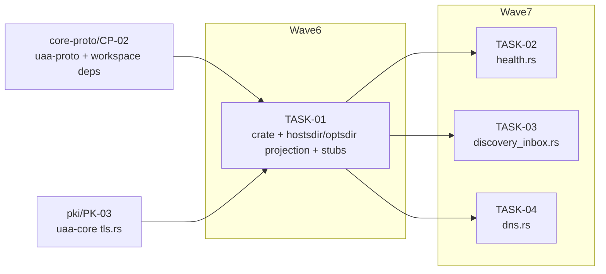

<!-- file: docs/agent-tasks/uaa-pxe/orchestration.md -->
<!-- version: 1.0.0 -->
<!-- guid: f98a1c7a-c91e-4985-8597-b8ac123cd211 -->
<!-- last-edited: 2026-07-10 -->

# uaa-pxe — orchestration

Four-task workstream in global waves 6–7 of the constellation plan. `TASK-01` creates `crates/uaa-pxe` (incl. the three stub files); `TASK-02/03/04` each fill exactly one disjoint stub in parallel once TASK-01 is merged. Cross-workstream gates: TASK-01 needs `core-proto/CP-02` (uaa-proto + workspace deps, wave 2) and `pki/PK-03` (`crates/uaa-core/src/tls.rs`, wave 5) merged first. See [../ORCHESTRATION.md](../ORCHESTRATION.md) for the full coordinator + worker protocol.

## Wave order for this workstream

| Global wave | This WS runs | Must be MERGED first |
|---|---|---|
| 6 | **TASK-01** (crate + boot-config projection + stubs) — runs alongside `uaa-web/WB-01` (disjoint new crate) | waves 1–5, specifically `CP-02` (proto/deps) and `PK-03` (tls.rs) |
| 7 | **TASK-02**, **TASK-03**, **TASK-04** in parallel (each fills one disjoint stub) | TASK-01 merged + siblings rebased |

## Dependency graph

Edges mean "waits for the upstream task's MERGE". Nodes outside the wave subgraphs belong to other workstreams and are shown only because they gate this one. No edges among PX-02/03/04 — disjoint stub files, parallel-safe (their shared `main.rs` arms are distinct and coordinator-rebased).



## Coordinator / worker protocol

> **Coordinator owns git. Workers never push.** Each worker operates only inside its
> assigned worktree: edit, test, commit — then stop. Workers never run `git push`,
> `gh pr`, or any merge command. The coordinator runs the gate (`cargo test --lib --offline && cargo build --offline`) in each
> finished worktree, opens the PR, merges (rebase/FF unless the repo profile says
> otherwise), and then **rebases every open sibling worktree** before dispatching
> anything else.
>
> **Per-merge sibling-rebase loop:** after EVERY merge to `origin/main`:
> for each open sibling worktree, `git fetch origin && git rebase
> origin/main`. A sibling that skips a rebase is a future conflict.
>
> **Conflict escalation ladder** (in order, never skip a rung): 1) clean rebase;
> 2) conflict-resolver subagent (Sonnet-class, only when the conflict spans 1–3 small
> files); 3) file-copy cherry-pick fallback — re-apply the task's file states onto a
> fresh branch from HEAD; 4) mark `rebase_blocked`, stop the lane, escalate to a human.
>
> **A wave MUST NOT start** while any of: the previous wave has an unmerged PR; any
> sibling worktree is un-rebased; the gate is red on `origin/main`; or a
> `rebase_blocked` marker is unresolved.

## Run it

```bash
# Wave 6 (after CP-02 + PK-03 are merged):
./run.sh 01

# Wave 7 (after TASK-01 is merged and siblings rebased):
./run.sh 02 03 04
```
