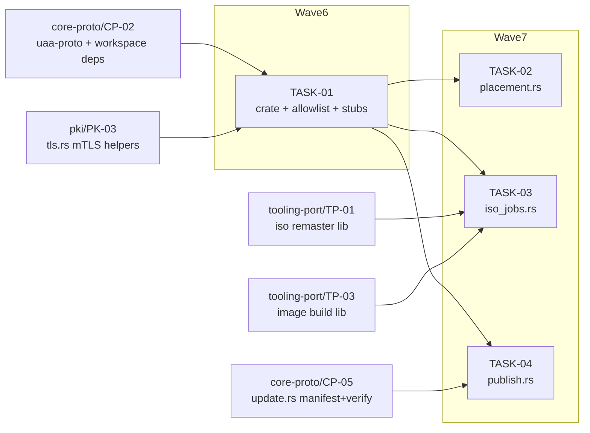

<!-- file: docs/agent-tasks/uaa-web/orchestration.md -->
<!-- version: 1.0.0 -->
<!-- guid: 2450318c-6c3f-4e12-a7ae-367414437af4 -->
<!-- last-edited: 2026-07-10 -->

# uaa-web — orchestration

Four tasks in two LOCAL waves that map onto GLOBAL constellation waves 6 and 7. Execution mode (from the plan skeleton): "SERIAL WAVES — WB-01 creates the crate, then WB-02/03/04 fill disjoint stubs in parallel". See [../ORCHESTRATION.md](../ORCHESTRATION.md) for the full coordinator + worker protocol; the collision gates below are this workstream's specifics.

## Wave order for this workstream

| Global wave | This WS runs | Must be MERGED first (cross-workstream) |
|---|---|---|
| ≤5 | — | CP-02 (uaa-proto + workspace deps, wave 2), TP-01 (wave 2), CP-05 + TP-03 (wave 3), PK-03 (tls.rs, wave 5) |
| 6 | **TASK-01** (crate + :8081 allowlist + :7445 mTLS + stubs) | waves 1–5 merged; runs alongside `uaa-pxe/PX-01` (disjoint new crates) |
| 7 | **TASK-02**, **TASK-03**, **TASK-04** (parallel — one stub file each) | TASK-01 merged; runs alongside `uaa-pxe/PX-02/03/04` (disjoint crates) |

## Dependency graph

Edges mean "waits for the upstream task's MERGE". Nodes outside Wave6/Wave7 belong to other workstreams and are shown only because they gate this one. No edges among WB02/WB03/WB04 — they fill disjoint stub files and are parallel-safe.



## Coordinator / worker protocol

> **Coordinator owns git. Workers never push.** Each worker operates only inside its
> assigned worktree: edit, test, commit — then stop. Workers never run `git push`,
> `gh pr`, or any merge command. The coordinator runs the gate (`cargo test --lib --offline && cargo build --offline`) in each
> finished worktree, opens the PR, merges (rebase/FF unless the repo profile says
> otherwise), and then **rebases every open sibling worktree** before dispatching
> anything else.
>
> **Per-merge sibling-rebase loop:** after EVERY merge to `origin/main`:
> for each open sibling worktree, `git fetch origin && git rebase
> origin/main`. A sibling that skips a rebase is a future conflict.
>
> **Conflict escalation ladder** (in order, never skip a rung): 1) clean rebase;
> 2) conflict-resolver subagent (Sonnet-class, only when the conflict spans 1–3 small
> files); 3) file-copy cherry-pick fallback — re-apply the task's file states onto a
> fresh branch from HEAD; 4) mark `rebase_blocked`, stop the lane, escalate to a human.
>
> **A wave MUST NOT start** while any of: the previous wave has an unmerged PR; any
> sibling worktree is un-rebased; the gate is red on `origin/main`; or a
> `rebase_blocked` marker is unresolved.

## Run it

```bash
# Wave 6 (only after CP-02 + PK-03 and all of waves 1-5 are merged):
./run.sh 01
# Wave 7 (only after TASK-01 is merged; 02/03/04 are parallel-safe):
./run.sh 02 03 04
```
