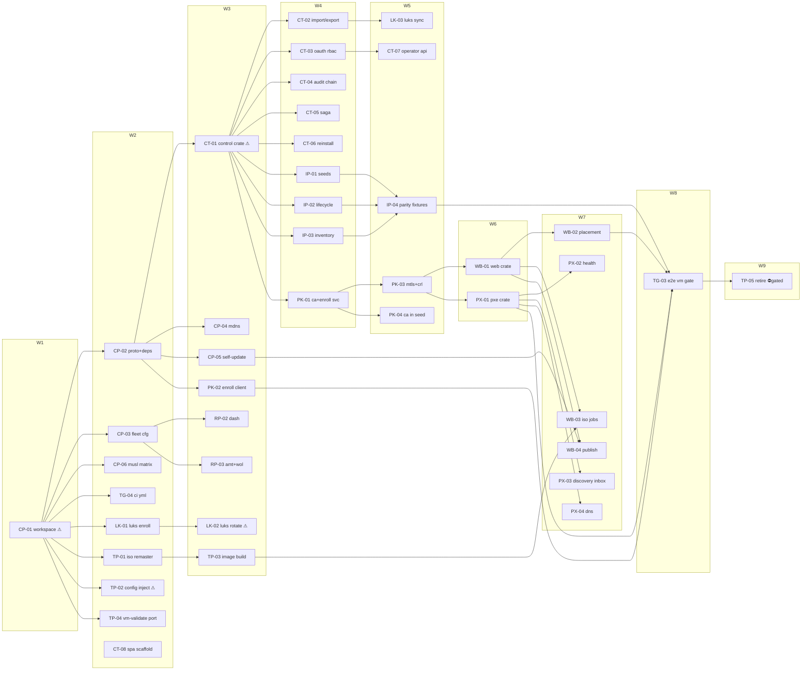

<!-- file: docs/specs/constellation-plan.md -->
<!-- version: 1.0.0 -->
<!-- guid: c99b8c1d-5cb2-4e73-aff2-4042671b0a6d -->
<!-- last-edited: 2026-07-10 -->

# uaa Constellation — Implementation Plan (taskboard)

Companion to:
- `docs/specs/constellation-design.md` (the judge-reviewed architecture; Decision numbers cited throughout)
- `docs/agent-tasks/BREAKDOWN-2026-07-10.md` (bucket sort + per-workstream tables)
- `docs/constellation/00-ROADMAP.md` (cross-workstream sequencing)
- Detailed execution interface: the 42 TASK briefs under `docs/agent-tasks/{core-proto,control,install-plane,pki,uaa-web,uaa-pxe,luks-keys,remote-power,tooling-port,testing-gates}/`

Coordination model: the coordinator reviews and owns ALL git/gh; worker subagents execute
one task each in an isolated worktree (`$REPO/.worktrees/<ws>-<slug>`, branch
`agent/<ws>-<slug>` off `origin/main`), PR per task, rebase/FF merges,
`cargo test --lib --offline && cargo build --offline` gates every PR. Tasks marked
**⚠ review-critical** change irreversible-stakes surfaces and require line-by-line
coordinator review before merge. Test baseline at plan time: **311 passing**
(`cargo test --lib --offline`).

The **de-collision pattern** used throughout: wave-1/skeleton tasks (CP-01, CT-01,
WB-01, PX-01) pre-create every follower's module file as a headered stub (and CP-01
additionally pre-wires every new `uaa` CLI subcommand variant + dispatch arm); each
follower task then fills EXACTLY ONE stub file. This is why waves 2–7 parallelize
cleanly despite one shared crate tree.

## Model assignments (authoritative — overrides per-task `Agent:` lines)

| Model | Tasks | Rationale |
|---|---|---|
| **Haiku-class** (5) | CP-06, TG-04, PX-04, LK-03 | mechanical mirrors of existing patterns; failure cheap, caught by the gate |
| **Haiku-class, gated** (1) | TP-05 | pure deletion — but ⛔ hard-gated on operator-confirmed M6 cutover |
| **Sonnet-class** (33) | CP-02..05, CT-02..08, IP-01..04, PK-01..04, WB-01..04, PX-01..03, LK-01, RP-02..03, TP-01, TP-03..04, TG-03 | new-service logic, protocol/state-machine work, parity semantics |
| **Opus/strong-class ⚠** (4) | CP-01 (workspace transform, collides with everything), CT-01 (registry SoR + WAL/degraded-mode data integrity), LK-02 (LUKS keyslot destruction + fleet lockout guard), TP-02 (real-secret injection guards) | irreversible stakes / cross-cutting judgment; line-by-line coordinator review before merge; never downgrade |

Tier-split note: 33/42 Sonnet-class exceeds the house ~2/3 heuristic — expected for a
greenfield-services package (little is a mechanical mirror of existing code); deviation
recorded per the fan-out cost rules.

## Dependency graph

An edge means "target waits for source's MERGE". No edge between same-wave siblings =
disjoint files per the collision matrix (recomputed by the auditor).

## ⚠️ Same-file collision matrix (computed from the skeleton Exact-files lists)

| Shared file | Tasks that touch it | Resolution |
|---|---|---|
| `Cargo.toml` (root) | CP-01, CP-02 | serialize: wave1=CP-01, wave2=CP-02 |
| `crates/uaa-core/src/power/mod.rs` | CP-01 (stub decls), CP-03 (fill) | serialize: wave1=CP-01, wave2=CP-03 |
| `crates/uaa-core/src/luks_keys.rs` | CP-01 (stub), LK-01, LK-02 | serialize: wave1=CP-01, wave2=LK-01, wave3=LK-02 |
| `crates/uaa-control/src/ca.rs` | CT-01 (stub), PK-01, PK-03 | serialize: wave3=CT-01, wave4=PK-01, wave5=PK-03 |
| stub-pattern files (each uaa-core stub by CP-01; uaa-control stubs by CT-01; uaa-web stubs by WB-01; uaa-pxe stubs by PX-01) | creator + exactly ONE filler each | serialize: dependency-ordered (stub wave strictly precedes fill wave) |

Rule enforced at generation: every stub file has exactly one filling task; two fillers
for one file would be a new collision row and a new wave.

## Parallel execution groups (global waves)

| Wave | Tasks (parallel within wave) | Prereq | Notes |
|---|---|---|---|
| W1 | CP-01 | none | Execution mode: SINGLE-AGENT (strong model) — trigger: judgment transform colliding with every later task; ⚠ line-by-line review |
| W2 | CP-02, CP-03, CP-06, TG-04, LK-01, TP-01, TP-02, TP-04, CT-08 | W1 merged + siblings rebased | Execution mode: PARALLEL DISPATCH within wave, SERIAL WAVES between — trigger: 9 tasks, disjoint files per collision matrix; TP-02 ⚠ gets line review |
| W3 | CP-04, CP-05, CT-01, PK-02, RP-02, RP-03, LK-02, TP-03 | W2 merged | Execution mode: PARALLEL DISPATCH within wave — trigger: 8 tasks, disjoint files; CT-01 + LK-02 ⚠ line review |
| W4 | CT-02, CT-03, CT-04, CT-05, CT-06, IP-01, IP-02, IP-03, PK-01 | W3 merged (CT-01 stubs exist) | Execution mode: PARALLEL DISPATCH within wave — trigger: 9 tasks, each fills one disjoint uaa-control stub |
| W5 | IP-04, CT-07, PK-03, PK-04, LK-03 | W4 merged | Execution mode: PARALLEL DISPATCH within wave — trigger: 5 tasks, disjoint (PK-03 serialized behind PK-01 per ca.rs row) |
| W6 | WB-01, PX-01 | W5 merged (PK-03 tls.rs) | Execution mode: PARALLEL DISPATCH — trigger: 2 new disjoint crates |
| W7 | WB-02, WB-03, WB-04, PX-02, PX-03, PX-04 | W6 merged | Execution mode: PARALLEL DISPATCH within wave — trigger: 6 tasks, each fills one disjoint stub |
| W8 | TG-03 | W4–W7 merged | Execution mode: SINGLE-AGENT (strong model) — trigger: harness-composition judgment, the M5 gate |
| W9 | TP-05 | TG-03 merged **+ ⛔ operator-confirmed M6 cutover + 2-week window (Bucket 3)** | Execution mode: SINGLE-AGENT — trigger: gated removal; NOT dispatchable by wave order alone |

No wave qualifies for `/parallel-sweep` (each wave mixes heterogeneous logic tasks, not
≥3 mechanically-similar edits with one pattern); within-wave parallel dispatch under the
coordinator protocol is the correct mode everywhere.

## Coordinator protocol (verbatim)

> **Coordinator owns git. Workers never push.** Each worker operates only inside its
> assigned worktree: edit, test, commit — then stop. Workers never run `git push`,
> `gh pr`, or any merge command. The coordinator runs the gate (`cargo test --lib
> --offline && cargo build --offline`) in each finished worktree, opens the PR, merges
> (rebase/FF unless the repo profile says otherwise), and then **rebases every open
> sibling worktree** before dispatching anything else.
>
> **Per-merge sibling-rebase loop:** after EVERY merge to `origin/main`: for each open
> sibling worktree, `git fetch origin && git rebase origin/main`. A sibling that skips a
> rebase is a future conflict.
>
> **Conflict escalation ladder** (in order, never skip a rung): 1) clean rebase;
> 2) conflict-resolver subagent (Sonnet-class, only when the conflict spans 1–3 small
> files); 3) file-copy cherry-pick fallback — re-apply the task's file states onto a
> fresh branch from HEAD; 4) mark `rebase_blocked`, stop the lane, escalate to a human.
>
> **A wave MUST NOT start** while any of: the previous wave has an unmerged PR; any
> sibling worktree is un-rebased; the gate is red on `origin/main`; or a
> `rebase_blocked` marker is unresolved.

## Task index (detail lives in the briefs — the briefs are the execution interface)

| Task | Brief | Title | Pri | Eff | Tier | Wave | Depends on |
|---|---|---|---|---|---|---|---|
| CP-01 ⚠ | core-proto/TASK-01 | workspace conversion + stub/CLI pre-wiring | P1 | L | Opus | 1 | — |
| CP-02 | core-proto/TASK-02 | uaa-proto crate + protox + workspace deps | P1 | M | Sonnet | 2 | CP-01 |
| CP-03 | core-proto/TASK-03 | FleetConfig parameterization | P1 | M | Sonnet | 2 | CP-01 |
| CP-04 | core-proto/TASK-04 | mDNS discovery (union resolve) | P1 | M | Sonnet | 3 | CP-02 |
| CP-05 | core-proto/TASK-05 | signed self-update lib | P1 | M | Sonnet | 3 | CP-02 |
| CP-06 | core-proto/TASK-06 | musl per-binary CI matrix | P2 | S | Haiku | 2 | CP-01 |
| CT-01 ⚠ | control/TASK-01 | control crate + CRDB schema + degraded mode | P1 | L | Opus | 3 | CP-02 |
| CT-02 | control/TASK-02 | registry CRUD + import/export | P1 | M | Sonnet | 4 | CT-01 |
| CT-03 | control/TASK-03 | GitHub OAuth + RBAC | P1 | M | Sonnet | 4 | CT-01 |
| CT-04 | control/TASK-04 | serialized audit chain | P1 | M | Sonnet | 4 | CT-01 |
| CT-05 | control/TASK-05 | approve SAGA | P1 | L | Sonnet | 4 | CT-01 |
| CT-06 | control/TASK-06 | one-click reinstall | P1 | M | Sonnet | 4 | CT-01, CP-03 |
| CT-07 | control/TASK-07 | operator API + OpenAPI + SPA host | P2 | M | Sonnet | 5 | CT-01, CT-03 |
| CT-08 | control/TASK-08 | React+Vite SPA scaffold | P2 | L | Sonnet | 2 | — |
| IP-01 | install-plane/TASK-01 | /autoinstall/* seed parity | P1 | M | Sonnet | 4 | CT-01 |
| IP-02 | install-plane/TASK-02 | register/checkin/webhook parity | P1 | L | Sonnet | 4 | CT-01 |
| IP-03 | install-plane/TASK-03 | inventory endpoint parity | P1 | M | Sonnet | 4 | CT-01 |
| IP-04 | install-plane/TASK-04 | parity fixtures + dashboard | P1 | M | Sonnet | 5 | IP-01..03 |
| PK-01 | pki/TASK-01 | install CA + EnrollService | P1 | L | Sonnet | 4 | CT-01 |
| PK-02 | pki/TASK-02 | agent enroll client | P1 | M | Sonnet | 3 | CP-02 |
| PK-03 | pki/TASK-03 | mTLS + CRL + service certs | P1 | M | Sonnet | 5 | PK-01 |
| PK-04 | pki/TASK-04 | CA cert in seed/ISO | P2 | S | Sonnet | 5 | PK-01 |
| WB-01 | uaa-web/TASK-01 | web crate + :8081 allowlist serve | P1 | M | Sonnet | 6 | CP-02, PK-03 |
| WB-02 | uaa-web/TASK-02 | placement RPCs + placeholder gate | P1 | L | Sonnet | 7 | WB-01 |
| WB-03 | uaa-web/TASK-03 | detached ISO build jobs | P2 | M | Sonnet | 7 | WB-01, TP-01, TP-03 |
| WB-04 | uaa-web/TASK-04 | binary publish + manifest | P1 | M | Sonnet | 7 | WB-01, CP-05 |
| PX-01 | uaa-pxe/TASK-01 | pxe crate + hostsdir boot config | P1 | L | Sonnet | 6 | CP-02, PK-03 |
| PX-02 | uaa-pxe/TASK-02 | dnsmasq/tftpd health | P2 | S | Sonnet | 7 | PX-01 |
| PX-03 | uaa-pxe/TASK-03 | discovery inbox | P1 | M | Sonnet | 7 | PX-01 |
| PX-04 | uaa-pxe/TASK-04 | DNS A/PTR | P3 | S | Haiku | 7 | PX-01 |
| LK-01 | luks-keys/TASK-01 | luks enroll/status | P1 | M | Sonnet | 2 | CP-01 |
| LK-02 ⚠ | luks-keys/TASK-02 | rotate/revoke + Tang guard | P1 | M | Opus | 3 | LK-01 |
| LK-03 | luks-keys/TASK-03 | credential registry sync | P2 | S | Haiku | 5 | LK-01, CT-02 |
| RP-02 | remote-power/TASK-02 | AMD DASH | P2 | M | Sonnet | 3 | CP-03 |
| RP-03 | remote-power/TASK-03 | Intel AMT + WoL | P2 | S | Sonnet | 3 | CP-03 |
| TP-01 | tooling-port/TASK-01 | uaa iso remaster | P1 | L | Sonnet | 2 | CP-01 |
| TP-02 ⚠ | tooling-port/TASK-02 | uaa config place/inject | P1 | M | Opus | 2 | CP-01 |
| TP-03 | tooling-port/TASK-03 | uaa image build | P2 | M | Sonnet | 3 | TP-01 |
| TP-04 | tooling-port/TASK-04 | uaa vm-validate | P2 | L | Sonnet | 2 | CP-01 |
| TP-05 ⛔ | tooling-port/TASK-05 | retire Python + shell (removal) | P3 | S | Haiku | 9 | TG-03 + operator gate |
| TG-03 | testing-gates/TASK-03 | constellation e2e VM gate | P1 | L | Sonnet | 8 | IP-04, PK-01/02, WB-02, PX-01 |
| TG-04 | testing-gates/TASK-04 | constellation CI yml | P2 | S | Haiku | 2 | CP-01 |

## Review gates for the coordinator

Line-by-line review mandatory: CP-01, CT-01, LK-02, TP-02 (the ⚠ four). Standard review:
all others. Every PR: gate green + the task's acceptance checklist pasted and ticked in
the PR description + COMPLETED/REMAINING/BLOCKED counts in the final status comment.
Milestone gates: M2 = IP-04 parity fixtures green in the VM loop; M3 = CA-backup runbook
exists before PK-01 deploys; M5 = TG-03 PASS; M6/W9 = operator-confirmed cutover
(Bucket 3) before TP-05 dispatches.
