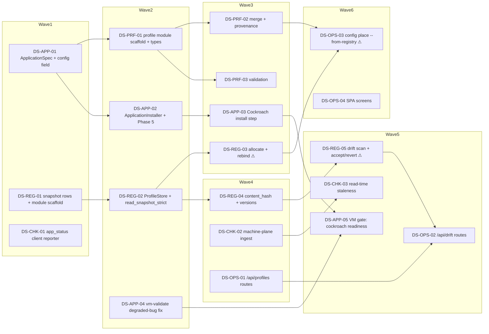

<!-- file: docs/specs/deploy-system-plan.md -->
<!-- version: 1.0.0 -->
<!-- guid: 84a72ca4-e93e-449b-affd-93f0bb3684fd -->
<!-- last-edited: 2026-07-16 -->

# Deployment System (profiles · applications · check-in) — Implementation Plan

Companion to:
- [`deploy-system-design.md`](deploy-system-design.md) — design spec v2.1 (decision IDs `D1`–`D19`, components `C1`–`C7`, milestones `M1`–`M5b`). Task source IDs are `DS-<WS>-NN`.

Baseline at planning time: `main` @ `82e4082`, `cargo test --lib --offline` = **634 passed** (50 uaa-control + 191 uaa + 391 uaa-core + 2 uaa-proto), `cargo build --offline` clean.

Coordination model: the coordinator reviews and owns ALL git/gh; worker subagents execute one task each in an isolated worktree, PR per task, rebase/FF merges, `cargo test --lib --offline && cargo build --offline` gates every PR. Tasks marked **⚠ review-critical** touch irreversible surfaces (index allocation, the snapshot store, the install flow) and require line-by-line coordinator review before merge.

> **This plan was adjudicated by a 3-lens design-judge panel** (correctness / ops-rollback / simplicity-scope) which **overturned the v1 persistence architecture**. The single most important inherited fact: **`uaa-control` has no CockroachDB connection in production** — `default_state()` (the only reachable prod state builder) constructs `FileRegistry(StatePaths)` + `MemEnrollmentStore` + `MemAuditStore`, and `db::migrations::apply` has no caller. Profiles therefore persist in the `StatePaths` snapshot (spec D4). **No task in this plan writes SQL or a migration.**

## Dependency graph

## Model assignments (authoritative — overrides per-task `Agent:` lines)

| Model | Tasks | Rationale |
|---|---|---|
| **Haiku-class** | DS-CHK-01, DS-APP-04, DS-OPS-04 | mechanical: mirror an existing module (`luks_sync`), a two-line shell-gate fix, and SPA screens following existing page patterns. Failure is cheap and caught by the gate. |
| **Sonnet-class** | DS-APP-01, DS-APP-02, DS-APP-03, DS-APP-05, DS-PRF-01, DS-PRF-02, DS-PRF-03, DS-REG-01, DS-REG-02, DS-REG-04, DS-CHK-02, DS-CHK-03, DS-OPS-01, DS-OPS-02 | logic, schema shape, installer integration, HTTP surface. ⚠-flagged get coordinator line-review. |
| **Opus/strong-class** | **DS-REG-03** (allocate + rebind), **DS-REG-05** (drift accept/revert), **DS-OPS-03** (`--from-registry`) | irreversible stakes. DS-REG-03 owns the fail-closed read that prevents a fleet-wide rename; DS-REG-05 owns the last-good-version revert semantics; DS-OPS-03 is the only behavior-changing task and mass-overwrites the webroot. Never downgrade these. |

Split: 3 Haiku : 14 Sonnet : 3 Opus across 20 Bucket-1 tasks — within the expected ~1/3 : 2/3 house ratio, weighted to Sonnet because most tasks integrate with existing seams rather than mirror them.

## ⚠️ Same-file collision table (computed from Exact-files lists, drives wave ordering)

| Shared file | Tasks that touch it | Resolution |
|---|---|---|
| `crates/uaa-core/src/network/ssh_installer/installer.rs` | DS-APP-02, DS-APP-03 | serialize: wave2=DS-APP-02, wave3=DS-APP-03 |
| `crates/uaa-core/src/network/ssh_installer/applications.rs` | DS-APP-02, DS-APP-03 | serialize: wave2=DS-APP-02, wave3=DS-APP-03 |
| `crates/uaa-control/src/db/mod.rs` | DS-REG-01, DS-REG-04 | serialize: wave1=DS-REG-01, wave4=DS-REG-04 |
| `crates/uaa-control/src/db/store.rs` | DS-REG-01, DS-REG-02 | serialize: wave1=DS-REG-01, wave2=DS-REG-02 |
| `crates/uaa-control/src/profiles/store.rs` | DS-REG-02, DS-REG-03 | serialize: wave2=DS-REG-02, wave3=DS-REG-03 |
| `crates/uaa-control/src/profiles/drift.rs` | DS-REG-04, DS-REG-05 | serialize: wave4=DS-REG-04, wave5=DS-REG-05 |
| `crates/uaa-core/src/profile/mod.rs` | DS-PRF-01, DS-PRF-02, DS-PRF-03 | scaffold-first: wave2=DS-PRF-01 creates mod.rs + stubs; wave3=DS-PRF-02/03 fill **disjoint** stub files (`merge.rs`, `validate.rs`) and do NOT re-edit mod.rs |
| `crates/uaa-control/src/operator/handlers.rs` | DS-OPS-01, DS-OPS-02 | serialize: wave4=DS-OPS-01, wave5=DS-OPS-02 |
| `crates/uaa-control/src/operator/api_types.rs` | DS-OPS-01, DS-OPS-02 | serialize: wave4=DS-OPS-01, wave5=DS-OPS-02 |
| `scripts/vm-validate.sh` | DS-APP-04, DS-APP-05 | serialize: wave2=DS-APP-04, wave5=DS-APP-05 |
| `examples/configs/install/vm-test.yaml` | DS-APP-05 | single writer — no collision |
| `crates/uaa-control/src/machine_plane/lifecycle.rs` | DS-CHK-02 | single writer — no collision |

**Scaffold-first pattern** (the repo's established CP-01 convention): `DS-PRF-01` and `DS-REG-01` each create their module's `mod.rs` **with every `pub mod` declaration and empty stub files**. Sibling tasks then fill one disjoint stub each and never re-edit `mod.rs`. Without this, every profile task would collide on `mod.rs`.

## Parallel execution groups

| Wave | Tasks (parallel within wave) | Prereq | Notes |
|---|---|---|---|
| **1** | DS-APP-01, DS-REG-01, DS-CHK-01 | none | disjoint files across two crates. **Execution mode: SINGLE-AGENT (strong model) per task, dispatched concurrently** — trigger: only 3 tasks and they are not mechanically similar (below the ≥3-similar-task `/parallel-sweep` floor); they are independent, so run them at the same time but do not sweep them. |
| **2** | DS-PRF-01, DS-REG-02, DS-APP-02, DS-APP-04 | wave 1 merged + siblings rebased | DS-APP-02 shares `installer.rs` with wave 3's DS-APP-03; DS-REG-02 shares `store.rs` with DS-REG-01. **Execution mode: SERIAL WAVES (coordinator-driven)** — trigger: DS-REG-02 shares `crates/uaa-control/src/db/store.rs` with wave-1's DS-REG-01 (collision table row 5). |
| **3** | DS-PRF-02, DS-PRF-03, DS-REG-03 ⚠, DS-APP-03 | wave 2 merged | DS-PRF-02/03 fill disjoint stubs created in wave 2. **Execution mode: SERIAL WAVES (coordinator-driven)** — trigger: DS-APP-03 shares `applications.rs` + `installer.rs` with wave-2's DS-APP-02 (collision rows 2–3). DS-REG-03 is ⚠ Opus-class, never parallelized with another `profiles/store.rs` writer. |
| **4** | DS-REG-04, DS-CHK-02, DS-OPS-01 | wave 3 merged | **Execution mode: SERIAL WAVES (coordinator-driven)** — trigger: DS-REG-04 shares `db/mod.rs` with wave-1's DS-REG-01 (collision row 4). |
| **5** | DS-REG-05 ⚠, DS-OPS-02, DS-CHK-03, DS-APP-05 | wave 4 merged | **Execution mode: SERIAL WAVES (coordinator-driven)** — trigger: DS-REG-05 shares `profiles/drift.rs` with wave-4's DS-REG-04 (collision row 7); DS-OPS-02 shares `handlers.rs`/`api_types.rs` with DS-OPS-01 (rows 9–10). |
| **6** | DS-OPS-03 ⚠, DS-OPS-04 | wave 5 merged | **Execution mode: SINGLE-AGENT (strong model)** — trigger: DS-OPS-03 is judgment work (the only behavior-changing task; mass-overwrites `/var/www/html/cloud-init/**`). Never parallelized, never weak-tier. |

Same-file serialization rules are the collision table above. **Highest-stakes track (`registry`) starts first**: DS-REG-01 is in wave 1 because DS-REG-03's fail-closed allocation is the design's core safety property and everything downstream of it needs the most soak time.

## Coordinator protocol (verbatim)

> **Coordinator owns git. Workers never push.** Each worker operates only inside its
> assigned worktree: edit, test, commit — then stop. Workers never run `git push`,
> `gh pr`, or any merge command. The coordinator runs the gate (`cargo test --lib --offline && cargo build --offline`) in each
> finished worktree, opens the PR, merges (rebase/FF unless the repo profile says
> otherwise), and then **rebases every open sibling worktree** before dispatching
> anything else.
>
> **Per-merge sibling-rebase loop:** after EVERY merge to `origin/main`:
> for each open sibling worktree, `git fetch origin && git rebase
> origin/main`. A sibling that skips a rebase is a future conflict.
>
> **Conflict escalation ladder** (in order, never skip a rung): 1) clean rebase;
> 2) conflict-resolver subagent (Sonnet-class, only when the conflict spans 1–3 small
> files); 3) file-copy cherry-pick fallback — re-apply the task's file states onto a
> fresh branch from HEAD; 4) mark `rebase_blocked`, stop the lane, escalate to a human.
>
> **A wave MUST NOT start** while any of: the previous wave has an unmerged PR; any
> sibling worktree is un-rebased; the gate is red on `origin/main`; or a
> `rebase_blocked` marker is unresolved.

---

## Task index

Full weak-model briefs live at `docs/agent-tasks/<ws>/TASK-NN-<slug>.md`. This table is the authoritative wave/tier/dependency source; the briefs are projections of it.

### WS `applications` — `crates/uaa-core` installer path

| Task | Src id | Title | Pri | Effort | Tier | Wave | Depends on |
|---|---|---|---|---|---|---|---|
| TASK-01 | DS-APP-01 | `ApplicationSpec` + defaulted `applications` field (+ `PartialEq` derive) | P1 | M | Sonnet-class | 1 | none |
| TASK-02 | DS-APP-02 | `ApplicationInstaller` module + Phase-5 wiring (scaffold, fail-closed) | P1 | M | Sonnet-class | 2 | DS-APP-01 |
| TASK-03 | DS-APP-03 | Cockroach install step (port `setup_cockroachdb.sh`) | P1 | L | Sonnet-class | 3 | DS-APP-02 |
| TASK-04 | DS-APP-04 | Fix `vm-validate.sh` accepting `degraded` as PASS | P0 | S | Haiku-class | 2 | none |
| TASK-05 | DS-APP-05 | VM gate: Cockroach readiness assertion + `vm-test.yaml` spec | P1 | M | Sonnet-class | 5 | DS-APP-03, DS-APP-04 |

### WS `registry` — `crates/uaa-control` persistence

| Task | Src id | Title | Pri | Effort | Tier | Wave | Depends on |
|---|---|---|---|---|---|---|---|
| TASK-01 | DS-REG-01 | Snapshot row types + `SnapshotDoc` collections + `profiles/` scaffold | P1 | M | Sonnet-class | 1 | none |
| TASK-02 | DS-REG-02 | `ProfileStore` trait + `SnapshotProfileStore` + **`read_snapshot_strict`** | P1 | M | Sonnet-class | 2 | DS-REG-01 |
| TASK-03 ⚠ | DS-REG-03 | `allocate_index` (fail-closed, insert-if-absent) + `rebind` | P0 | L | **Opus-class** | 3 | DS-REG-02 |
| TASK-04 | DS-REG-04 | `content_hash` (explicit canonicalization) + `profile_versions` | P1 | M | Sonnet-class | 4 | DS-REG-02 |
| TASK-05 ⚠ | DS-REG-05 | Drift scan + accept/revert (last-good-version semantics) | P1 | L | **Opus-class** | 5 | DS-REG-04 |

### WS `profiles` — `crates/uaa-core` pure schema/merge

| Task | Src id | Title | Pri | Effort | Tier | Wave | Depends on |
|---|---|---|---|---|---|---|---|
| TASK-01 | DS-PRF-01 | `profile/` scaffold: `mod.rs` types + `merge.rs`/`validate.rs` stubs | P1 | M | Sonnet-class | 2 | DS-APP-01 |
| TASK-02 | DS-PRF-02 | `merge()` + provenance + 10-required-field fail-closed | P1 | L | Sonnet-class | 3 | DS-PRF-01 |
| TASK-03 | DS-PRF-03 | Validation: global hostname uniqueness, immutability, standalone | P1 | M | Sonnet-class | 3 | DS-PRF-01 |

### WS `checkin` — application status

| Task | Src id | Title | Pri | Effort | Tier | Wave | Depends on |
|---|---|---|---|---|---|---|---|
| TASK-01 | DS-CHK-01 | `app_status.rs` client reporter (mirror `luks_sync`) | P2 | S | Haiku-class | 1 | none |
| TASK-02 | DS-CHK-02 | Machine-plane ingest + snapshot field | P2 | M | Sonnet-class | 4 | DS-CHK-01 |
| TASK-03 | DS-CHK-03 | Read-time staleness (`Stale` ≠ healthy) | P2 | M | Sonnet-class | 5 | DS-CHK-02 |

### WS `operator-api` — HTTP + SPA

| Task | Src id | Title | Pri | Effort | Tier | Wave | Depends on |
|---|---|---|---|---|---|---|---|
| TASK-01 | DS-OPS-01 | `/api/profiles` route group + DTOs (Viewer/Operator) | P2 | M | Sonnet-class | 4 | DS-REG-02 |
| TASK-02 | DS-OPS-02 | `/api/drift` review routes (accept/revert) | P2 | M | Sonnet-class | 5 | DS-OPS-01, DS-REG-05 |
| TASK-03 ⚠ | DS-OPS-03 | `config place --from-registry` (dry-run default, `.bak`) | P1 | L | **Opus-class** | 6 | DS-PRF-02, DS-REG-03 |
| TASK-04 | DS-OPS-04 | SPA: profile + drift screens, staleness rendering | P3 | M | Haiku-class | 6 | DS-OPS-02 |

## Review gates for the coordinator

**Line-by-line review mandatory** on the three ⚠ tasks, and why each:

- **DS-REG-03** — owns `read_snapshot_strict` usage. `read_snapshot` **fails open to an empty `SnapshotDoc`** on a missing *or corrupt* file (it logs `"serving EMPTY registry (degraded)"`). An allocator reading through it sees zero bindings and **re-allocates every index from 1, renaming the entire fleet**. Review specifically: that no allocation path calls `read_snapshot`, `unwrap_or_default()`, or `.unwrap_or_else(|_| SnapshotDoc::default())`; that `MemProfileStore` is `#[cfg(test)]`-gated so the wrong wiring cannot compile.
- **DS-REG-05** — owns revert semantics. Review specifically: that revert restores **the newest version whose body still hashes to its own stored `content_hash`**, never a blind `N−1`; that the drifted body is captured as a version row *before* any review action; that mutations use `AuditStore::append_in_txn`, never `record()`.
- **DS-OPS-03** — the only behavior-changing task. Review specifically: `--dry-run` defaults **on**; `.bak` written before any overwrite; `--from-registry` defaults **off**; the resolved text still satisfies the line-based `inject_secrets` / `inject_install_ca_cert` matchers and the `REPLACE_AT_PLACE_TIME` hard gate.

Standard review: all others. Every PR: gate green + the task's acceptance checklist pasted and ticked in the PR description + COMPLETED/REMAINING/BLOCKED counts in the final status comment.
