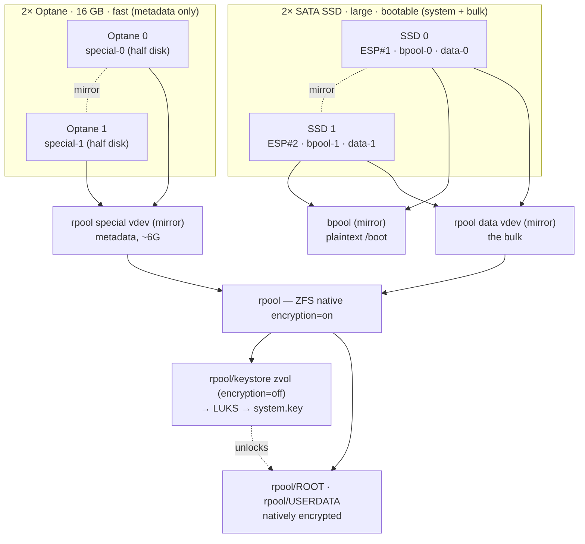

<!-- file: docs/specs/u1-zfs-native-encryption-design.md -->
<!-- version: 1.2.0 -->
<!-- guid: e7a1c9d4-2b6f-4e83-9a15-8c4d0f7b3e21 -->
<!-- last-edited: 2026-07-23 -->

# U1 ZFS Native Encryption + Keystore — Design Spec

Design for migrating **unimatrixone (U1)** from the current plain
ZFS-on-LUKS single-disk install path to **ZFS native encryption on the Ubuntu
stock keystore-zvol layout**, across a **4-drive topology**, with the
VM-gate-validated **D2-B** unlock policy and **Secure Boot** enabled.

Companion: [implementation plan](u1-zfs-native-encryption-plan.md). Research
basis: [`docs/research/2026-07-17-zfs-native-encryption-*.md`](../research/)
(architecture, adversarial design-review, recommendation) and the VM-gate
results at `/mnt/bigdata/backup/testing/tpmvm-lab/RESULTS.md` on the server.
Live topology map: <https://claude.ai/code/artifact/59a5caac-dde1-4143-8f21-063c7a24ba43>.

> **This is a plan, not an implementation.** Nothing here is built. U1 is
> **powered off** and stays off until an explicit operator checkpoint after the
> VM gate is green (§9). The existing Lenovo (`len-serv-*`) plain-LUKS path
> must remain **fully intact** — the new layout is *selectable*, never a
> destructive replacement (Decision 9).

## 1. One-paragraph summary

Build the pool with **ZFS native encryption** (`encryption=on`,
`encryptionroot=rpool`), keyed from a **keystore zvol** (`rpool/keystore`,
`encryption=off`) that holds a LUKS container wrapping `system.key`. The
keystore LUKS is unlocked at boot by **clevis SSS `t=2`** over
**{3 Tang (thumbprint-pinned) + 1 TPM2 peer-share}** — no `systemd-tpm2` /
`systemd-fido2` tokens (they hang the boot). Two large SATA SSDs carry **boot +
bulk** (ESP + bpool + the rpool data mirror); two small Optanes carry the pool's
fast **metadata** (a mirrored `special` vdev). Secure Boot is on, using
Canonically-signed modules. Break-glass is a recovery key at IPMI SOL.

> **Revised 2026-07-23:** an earlier draft put boot (ESP + bpool) on the
> Optanes. The X10DSC+ firmware **cannot boot from NVMe** — it enumerates the
> Optanes for the OS but its UEFI boot manager has no NVMe entry (proved with a
> clean ext4 test install that would not boot off the Optane). Boot therefore
> lives on the SATA SSDs; the Optanes are reduced to a **half-disk** `special`
> vdev, with the other half reserved for a future spinning-disk array's special
> vdev.

## 2. Topology

Partition scheme (both SSDs symmetric; both Optanes symmetric, half-disk):

| Device | p1 | p2 | p3 |
|---|---|---|---|
| SSD 0 (large, boot) | ESP #1 (~1 G, FAT32, NVRAM) | bpool-0 (~2 G) | data-0 (rest) |
| SSD 1 (large, boot) | ESP #2 (~1 G, FAT32, NVRAM) | bpool-1 (~2 G) | data-1 (rest) |
| Optane 0 (16 G) | special-0 (6 G) · rest free | — | — |
| Optane 1 (16 G) | special-1 (6 G) · rest free | — | — |

- `bpool = mirror(SSD0.p2, SSD1.p2)` — unencrypted `/boot` on bootable SATA.
- `rpool = mirror(SSD0.p3, SSD1.p3) [data] + mirror(Optane0.p1, Optane1.p1) [special]`.
- The Optane `special` partition is **half the drive**; the other half is left
  unpartitioned, reserved for a future spinning-disk array's special vdev.
- Both ESPs registered in NVRAM; **never** mdadm-mirrored (firmware/fwupd write
  behind md's back and a later resync can push a stale ESP over a fresh one).

## 3. Decisions (settled)

1. **ZFS native encryption + Ubuntu stock keystore-zvol layout** — not plain
   ZFS-on-LUKS, not a custom encryptionroot. Stock means no patched
   `zfs-load-key.sh` to carry across `zfs-linux` updates (a real 25.10 bug hit
   an `rpool/enc` custom root). Encryptionroot = the stock `rpool/ROOT` (and
   `rpool/USERDATA`); the pool **root** `rpool` and `rpool/keystore` are left
   **unencrypted**, `keylocation=file:///run/keystore/rpool/system.key` on the
   encryptionroots. (Corrected 2026-07-22 after a live build on U1 real hardware:
   an earlier draft said "encryptionroot = the bare `rpool`", which is
   impossible — ZFS **inherits** encryption downward, so a child of an encrypted
   dataset cannot be `encryption=off`; the keystore zvol MUST hang off an
   unencrypted parent. `rpool/ROOT`+`rpool/USERDATA` are the *stock* Ubuntu
   encryptionroots, not a custom `rpool/enc`, so the "stock, not custom" intent
   above still holds.)
2. **4-drive topology with a `special` allocation-class vdev.** Boot + bulk data
   on the SATA SSD mirror; metadata on the Optane mirror. This is what lets 16 G
   Optanes accelerate a multi-TB pool without matching its size, and puts "the
   vast majority of rpool" on the SSDs. `special_small_blocks=0` (metadata only)
   — the data pool is itself SSD, so there is no small-file latency to offload
   (offload only pays in front of spinning rust; decision 2026-07-23). The
   special vdev **must** be mirrored — its loss faults the pool. The Optane
   `special` partition is **half-disk**; the other half is reserved for a future
   spinning-disk array's special vdev. **Boot lives on the SATA SSDs, not the
   Optanes** (2026-07-23): the X10DSC+ firmware cannot boot NVMe, so ESP + bpool
   moved off the Optane onto the bootable SATA disks.
3. **Keystore = zvol(`encryption=off`) wrapping a LUKS container.** `encryption=off`
   is at the **ZFS layer only**, so the zvol is readable on `zpool import`
   *without* rpool's key — this breaks the chicken-and-egg (the key lives inside
   the pool it unlocks). What import exposes is **LUKS ciphertext, not the key**;
   Tang/clevis must unlock the LUKS before `system.key` is readable. Functionally
   identical to a standalone LUKS key-partition, but it inherits the pool mirror
   for free.
4. **Unlock policy D2-B — clevis SSS `t=2` over {3 Tang + TPM2 peer}.** On the
   keystore LUKS:
   `{"t":2,"pins":{"tang":[3× {url,thp}],"tpm2":{"pcr_ids":"7","pcr_bank":"sha256"}}}`.
   TPM2 is a *sub-threshold peer share* (1 < t=2): it improves availability
   (survives 2 Tang down) without weakening the threat model (a lone TPM2 can
   never reach t=2). VM-gate-validated: the clevis token type is foreign to
   systemd, so it never triggers the R4 boot-hang.
   - **Why `t=2`, not "all 3 Tang required" (`t=3`/`t=4`)** (settled 2026-07-22):
     the threat protection comes from the **TPM2 share being PCR7-bound and
     physically un-removable**, *not* from the Tang count. Stolen/off-LAN, no
     Tang is reachable → TPM alone = 1 < 2 → **stays locked** regardless of
     threshold. Raising `t` to require more Tang buys **no** anti-theft margin
     (off-LAN is already locked) and **destroys availability**: the home Tang
     servers are RPis that reboot / drop PoE / fail (rpi-serv-002 was found down
     during the U1 build), so "all 3 required" bricks boot on any single RPi
     outage. `t=2` is exactly the "survives 2 Tang down" property. On-LAN
     evil-maid hardening is a *different* lever (TPM+PIN / physical presence),
     deliberately deferred (Decision 5, R4 hang) — not the Tang count.
   - **`pcr_bank` MUST be `sha256`** (found 2026-07-22 on the live bind): clevis
     defaults the tpm2 pin to `pcr_bank:"sha1"`, but Secure Boot (Decision 7)
     measures PCR 7 into the **SHA-256** bank; some firmware doesn't even
     populate the sha1 bank. Bind against sha256 explicitly or the peer unseal
     breaks once SB is on.
5. **No `systemd-tpm2` / `systemd-fido2` tokens.** `enroll_tpm2: false`,
   `expect_fido2: false`. These hang the boot (R4) *and* can never be
   unattended. The clevis `tpm2` **pin** (Decision 4) is a different mechanism
   and is kept; the systemd token path is dropped entirely.
6. **Fatal Tang bind + verify guard.** The clevis bind failure is currently
   swallowed as non-fatal (`system_setup.rs:793`) — it becomes **fatal**
   (fail-closed: no silent passphrase-only fallback). `verify` gains a guard
   that **fails** if a `systemd-tpm2`/`systemd-fido2` token exists on the
   keystore (D7.4) — the two silent killers.
7. **Secure Boot enabled.** Canonically-signed ZFS module via
   `linux-modules-extra` (**not** `zfs-dkms`, which needs a MOK and perturbs
   PCR 7); signed `shim` → `grub` → kernel chain; `grub-install --uefi-secure-boot`.
   The TPM2 pin binds **PCR 7** (Secure Boot state) — correct anti-theft, but
   MOK/SB-key changes move PCR 7 and break the TPM2 peer *gracefully* (Tang
   still unlocks). See §6.
8. **Two ESPs, both in NVRAM, kept in sync** (D7.3) — independent, so a dead
   disk still boots via the survivor's ESP.
9. **The Lenovo plain-LUKS path is preserved.** `len-serv-*` continue to
   install exactly as today. The native-encryption layout is selected by config
   (a storage-mode discriminator), never by mutating the existing path.

## 4. The keystore & the circularity (why it's safe)

`zpool import rpool` does **not** decrypt anything — it only assembles the pool.
Because `rpool/keystore` has `encryption=off`, its device node
`/dev/zvol/rpool/keystore` is readable right after import. But its *content* is
a LUKS header + ciphertext. The boot sequence:

1. import `rpool` (no key)
2. wait for `/dev/zvol/rpool/keystore` (udev is async — **D7.1 hook**, §5)
3. `clevis-luks-askpass` unlocks the keystore LUKS via Tang (SSS `t=2`)
4. mount it → `system.key` at `/run/keystore/rpool/system.key`
5. `zfs load-key rpool` → encrypted datasets unlock → root mounts → pivot

At no point is the ZFS master key exposed to an attacker who only has the disks:
they get LUKS ciphertext, and LUKS is unlocked only by Tang (on-LAN) or the
recovery key (attended).

## 5. Boot ordering hazards (design-review §D7)

- **D7.1 `91uaa-keystore-wait` dracut hook — MANDATORY.** The Ubuntu dracut
  port dropped the zvol wait loop; udev creates `/dev/zvol/*` asynchronously, so
  `zfs load-key` can fire before the node exists → emergency shell. The hook
  blocks (`pre-mount 89`) until the keystore zvol appears. Without it this is an
  intermittent race — the worst failure class.
- **D7.2 `network-online` ordering drop-in.** clevis's auto-wiring never fires
  on Ubuntu (`hostonly_cmdline` empty), so `clevis-luks-askpass` isn't ordered
  after `network-online.target`. We already set `rd.neednet=1 ip=dhcp` by hand
  (`system_setup.rs`); this is the other half.

## 6. Secure Boot

| Concern | Decision |
|---|---|
| ZFS module | Canonically-signed `linux-modules-extra-<ver>` for `linux-image-generic`. **Never `zfs-dkms`** (unsigned rebuild → MOK → PCR 7 churn). |
| Boot chain | `shim-signed` → `grub-efi-amd64-signed` → signed kernel (installer already pulls these); `grub-install --uefi-secure-boot`. |
| initramfs | Loaded by the already-verified kernel; not itself signature-checked, so clevis/dracut in the initramfs is fine. |
| TPM2 binding | PCR 7 = Secure Boot state. Correct anti-theft (disabling SB moves PCR 7 → TPM2 won't unseal). MOK enrollment / SB-key change also moves it → TPM2 peer breaks **gracefully** (Tang unlocks; no hang). |
| VM gate | **Must** run with OVMF **Secure Boot ON** + swtpm, or the PCR 7 binding and signed chain aren't actually proven. |

## 7. Threat model & accepted risk

**Tang authenticates nothing.** Anyone who powers this box on with LAN reach to
2-of-3 Tang gets a decrypted machine — **whoever controls the LAN controls the
disk.** Disk theft is defeated (the real win); machine-theft-plus-network is
not, and cannot be while unattended reboot is the requirement. This is a
*written-down accepted risk*, not a gap to close.

Unlock outcomes (SSS `t=2` over {3 Tang + TPM2}):

| Scenario | Shares | Result |
|---|---|---|
| All 3 Tang up | 3–4 | ✓ unattended |
| 1 Tang down | 2–3 | ✓ unattended |
| 2 Tang down | TPM2 + 1 Tang = 2 | ✓ unattended (the TPM2 win) |
| Stolen, no LAN | TPM2 alone = 1 | ✗ locked (1 < t=2) |
| Disk pulled | 0 | ✗ locked |
| Tang down + operator | recovery key at SOL | ✓ attended |

## 8. Invariants to preserve

- **Lenovo path byte-identical** where the mode discriminator selects "plain
  LUKS" (Decision 9). No test regressions on `len-serv-*` configs.
- **Fail-closed everywhere**: fatal Tang bind (Decision 6); a config still
  holding `REPLACE_AT_PLACE_TIME` after injection is refused; `verify` guard
  rejects systemd token drift.
- **Never a systemd-tpm2/fido2 token on the keystore** (would reintroduce R4).
- **`special` vdev mirrored**; two ESPs never mdadm; keystore LUKS never has its
  passphrase/recovery slot wiped during cleanup (R6).

## 9. Open preconditions (must clear before U1 touches this)

1. **U1 disk inventory confirmed** — exactly 2× Optane 16 G + 2× large SSD, and
   which enumerate as which (`lsblk`, by-id). The partitioner is written to
   *by-id*, not `sdX`.
2. **Optane capacity = 16 G confirmed** → `special_small_blocks=0` (metadata
   only). Larger later would allow small-block spillover.
3. **TPM 2.0 present + working on U1** — already confirmed this session
   (9665H-C, `/dev/tpmrm0`, `has-tpm2`).
4. **BIOS**: Optane bifurcation (x4x4x4x4 on the CPU2 IOU driving the slot),
   Secure Boot enabled, TPM=2.0 — a hardware checkpoint, not software.
5. **VM gate green with OVMF Secure Boot ON** for every §7 scenario before any
   U1 power-on.

## 10. Non-goals

- No change to the `len-serv-*` install path.
- No FIDO2/YubiKey enrollment on U1 (removed, not deferred — Decision 5).
- No production `config place --from-registry` flip (separate operator gate).
- U1 power-on is **out of scope for the software plan** — it is a distinct,
  explicit operator action after the VM gate passes.
